# P1 — ESP-NOW Sensor Mesh with Cloud Bridge

**Course:** IA736001 Internet of Things and Cloud Computing
**Authors:** Bhanu Gupta (100012452) and Roshan Aryal (1000123440)
**Date:** 3 August 2026
**Contributions:** Both authors contributed equally, a 50/50 split across design,
implementation, hardware testing and documentation. Section 11.1 is a joint reflection.

---

## 1. Introduction

This project implements a two-node wireless sensor system built from two ESP32 development
boards. One board measures temperature and humidity and transmits its readings over ESP-NOW,
a connectionless peer-to-peer protocol. The second board measures its own local environment,
receives the first board's readings wirelessly, merges both datasets, and publishes the
combined result to a ThingsBoard cloud instance over MQTT.

No wire connects the two boards. Each is powered independently over USB, and the only link
between them is a 2.4 GHz radio.

**Scope, stated up front.** This is a **two-node ESP-NOW prototype with a mesh-ready packet
design**. It is not a demonstrated multi-hop mesh network. With two radios the physical
topology can only ever be one hop: a root and a node. The packet format carries `ttl` and
`hop_count` fields and uses source/destination addressing rather than broadcast, so it would
not have to change if a third board were added and forwarding logic written — but no packet
in this project is ever forwarded, because there is nowhere to forward it to. This
distinction is maintained throughout the report.

What the system does demonstrate:

| Concept | How it appears |
|---|---|
| Peer-to-peer wireless without an access point | Board 1 never associates with the router, yet its data reaches the cloud |
| Root/gateway addressing | `src_id`/`dst_id` in every packet; unicast to a specific MAC |
| Edge aggregation | Board 2 merges two sensor sources before data leaves the network |
| Cloud fan-in | Two physical sensors, one cloud device, one telemetry stream |
| Duplicate detection | `(src_id, boot_id, seq)` key with a rejection counter |
| Liveness detection | `node1_online` flips false 20 s after the last valid packet |

### 1.1 Relationship to the Case Study Analysis

Part 1 of this assessment analysed the proposed system before it was built. This portfolio
reports what was built, and the two align on every substantive point.

| Case Study Analysis proposed | This implementation delivers |
|---|---|
| Two ESP32 boards, one sensing node and one edge gateway | Board 1 (`44:1D:64:F5:FA:24`) and Board 2 (`44:1D:64:F4:F1:C8`), §2 |
| Three-tier arrangement: node, edge gateway, cloud | §4, with the gateway merging before anything leaves the network |
| ESP-NOW on the local leg, MQTT to the cloud | §5 and §7.5; 26-byte frames, JSON telemetry on port 1883 |
| Channel discovered at runtime, not chosen | §4.2; the gateway reports the channel it landed on, and the node is pinned to match |
| Edge aggregation to reduce cloud traffic | Two 26-byte frames every 5 s become one publish every 10 s, §8.3 |
| Deduplication on `(src_id, boot_id, seq)` | §6, with a node restart correctly distinguished from a replay |
| Link encryption with a pre-shared key pair | §7.9.3; PMK plus per-peer LMK, verified on hardware |
| ThingsBoard PaaS for registry, ingestion and dashboards | §7.5 and §8.10 |

Two differences are worth stating plainly rather than leaving for a reader to notice.

**The sensor changed.** The brief specified BMP280; the available hardware was DHT11. This
alters what the system measures — humidity instead of pressure — but not the architecture being
demonstrated. §3 sets out the substitution and its consequences in full.

**The implementation went further than the analysis.** The case study closed by recommending
work on the cloud leg. Two capabilities were added afterwards that it does not describe:
server-to-device RPC, so the cloud can change device behaviour rather than only observe it,
and a store-and-forward buffer that preserves telemetry across a broker outage. Both are
specified in §7.6 and verified on hardware in §8.9.

---

## 2. Hardware

### 2.1 Components

| Item | Quantity | Notes |
|---|---|---|
| ESP32 DevKit (USB-C) | 2 | ESP32-D0WD-V3 rev 3.1, dual core, 240 MHz |
| DHT11 temperature/humidity module | 2 | Three-pin, integrated pull-up resistor |
| Breadboard | 2 | Half-size |
| Jumper wires | — | Female-to-female / female-to-male |
| USB data cables | 2 | Separate power for each board |

No Raspberry Pi, no external LEDs or resistors, and no wired connection between the boards.

### 2.2 Wiring

**Board 1 — Remote Sensor Node**

| Wire colour | ESP32 pin | DHT11 pin |
|---|---|---|
| Green | `3V3` | `+` / VCC |
| Orange | `GND` | `−` / GND |
| Yellow | `D4` = **GPIO4** | `S` / OUT / DATA |

**Board 2 — Root Gateway + Local Sensor**

| Wire colour | ESP32 pin | DHT11 pin |
|---|---|---|
| Green | `3V3` | `+` / VCC |
| Orange | `GND` | `−` / GND |
| Yellow | `D5` = **GPIO5** | `S` / OUT / DATA |

The silkscreen labels `D4` and `D5` correspond to GPIO4 and GPIO5. The Arduino API takes
the integer pin number, so the code uses `4` and `5` rather than the string labels.

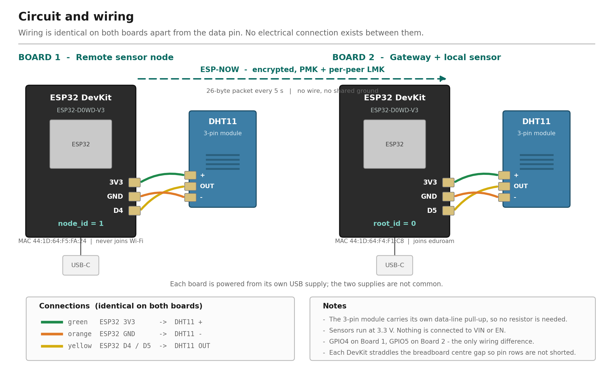

**Figure 1** — Circuit and wiring. The two boards are electrically independent: each has its
own USB supply and its own ground, and the only path between them is the encrypted ESP-NOW
link drawn as a dashed line. The wiring is identical on both boards apart from the data pin,
GPIO4 on Board 1 and GPIO5 on Board 2.

### 2.3 Safety constraints observed

- Both ESP32 boards straddle the breadboard centre gap, so opposing pin rows are not
  shorted together.
- Nothing is connected to `VIN` or `EN`.
- Both sensors run at 3.3 V. The three-pin DHT11 modules carry their own data-line pull-up,
  so no external resistor was required.
- Only one board was connected during each firmware upload, to eliminate the risk of
  flashing the wrong image to the wrong board.
- Both boards are powered simultaneously for operation.

### 2.4 Photographic evidence

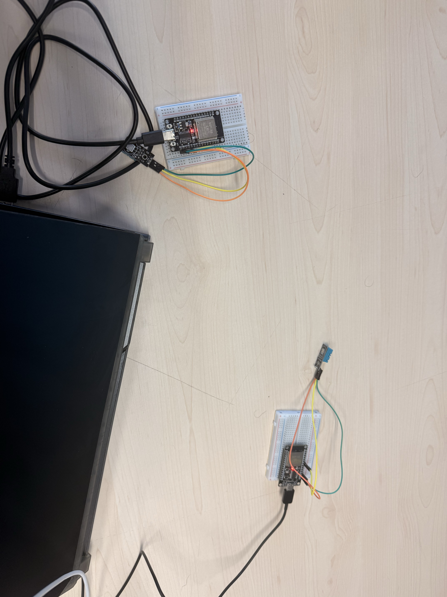

**Figure 2** — Both boards operating, each powered from its own USB cable, with no wire
between them. This is the primary evidence that the link is wireless: any data appearing
on the gateway from the remote node can only have arrived by radio.

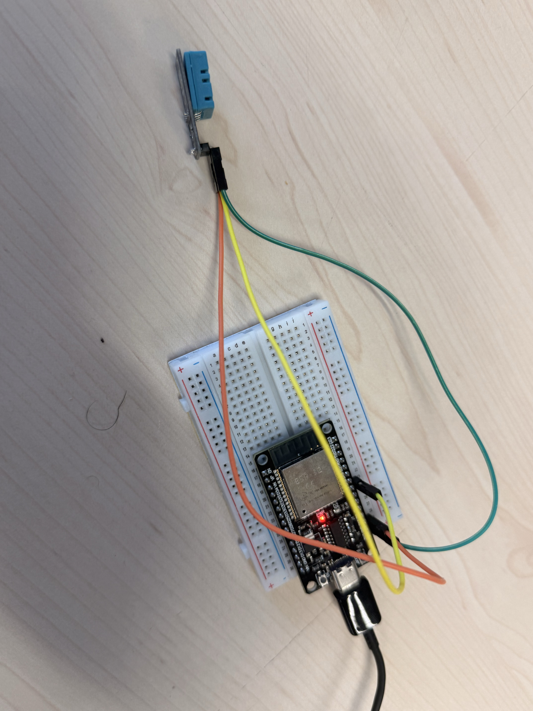

**Figure 3** — Wiring detail. Green to `3V3`, orange to `GND`, yellow to the data pin. The
three-pin DHT11 module carries its own pull-up resistor, so no external component is needed.

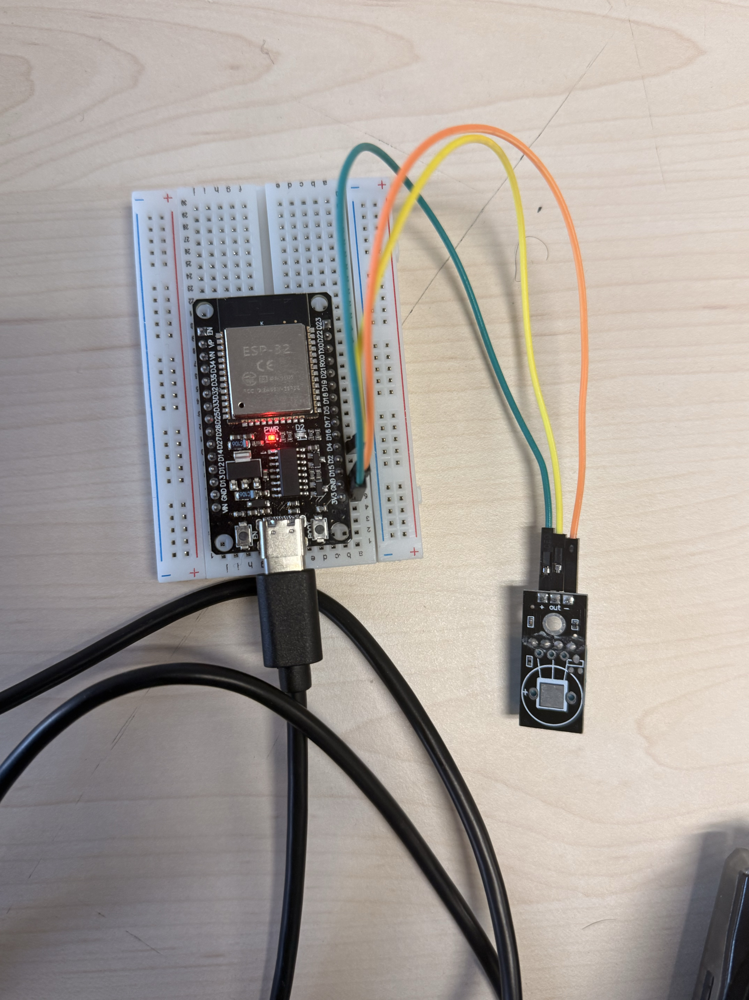

**Figure 4** — The ESP32 straddles the breadboard centre gap so that opposing pin rows are
not shorted together, and the pin labels remain legible for verification.

---

## 3. Hardware substitution: DHT11 in place of BMP280

The original project brief specified BMP280 pressure and temperature sensors. The hardware
actually available was DHT11. This is a documented substitution, and it changes what the
system measures.

**Consequences:**

- The measured quantities are **temperature (°C) and relative humidity (% RH)**. No
  pressure is measured anywhere in this project, and no altitude is derived.
- The DHT11 uses a single-wire bit-banged protocol on one GPIO, not I²C. No I²C bus is used
  and no BMP280 libraries are installed.
- The DHT11 is a low-resolution part: approximately ±2 °C and ±5 % RH, with roughly 1 °C
  quantisation. This is visible in the results as stepped rather than smooth traces.
- The sensor must not be read more often than once per second. The implementation reads
  every two seconds.

**What is unaffected.** The substitution changes only the sensing layer. ESP-NOW transport,
packet design, addressing, deduplication, aggregation, MQTT publishing and the cloud
dashboard are all independent of which sensor supplies the numbers. Substituting humidity
for pressure gave the system two measurands rather than one, which is arguably a slightly
richer demonstration of the aggregation logic than temperature-plus-pressure would have been,
since both quantities come from the same sensor and travel through the same code path.

### 3.1 Assessment: did the substitution weaken the demonstration?

On balance, no — but it moved the cost from one place to another rather than eliminating it.

**What was genuinely lost.** Two things. First, no I²C experience. A BMP280 is an I²C device,
so the original brief would have required handling device addressing, bus pull-ups, and
potentially two devices sharing one bus. The DHT11 is a single-wire bit-banged protocol on
one GPIO with the pull-up already on the module, which is strictly simpler. That is a
reduction in scope, and it is fair to say the sensing layer of this project is easier than
the brief intended.

Second, resolution. The DHT11 quantises to roughly 1 °C, which is why the dashboard traces in
§8 appear as staircases rather than curves. A BMP280 resolves to about 0.01 °C and would have
produced visibly smoother, more convincing charts from identical code.

**What was unaffected.** Everything above the sensing layer. The packet carries two `float`
values and does not care what physical quantity they represent; ESP-NOW transport,
addressing, deduplication, aggregation, MQTT publishing and the dashboard are all identical
regardless of sensor. Since the project's stated aims are about the *network and data path*
rather than about sensing, the substitution leaves the assessed content intact.

**What was arguably gained.** Humidity turned out to be a better demonstration variable than
pressure would have been. Indoor barometric pressure is very nearly static over the timescale
of a live demonstration — it would have produced a flat line for several hours. Humidity
responds within seconds to a hand or breath near the sensor. During testing, warming Board 1's
sensor by hand drove its reading from 21.4 °C to 28.9 °C with humidity falling from 48 % to
31 %, and both relaxed back toward ambient once released (§8.7). That visible, controllable,
bidirectional response makes it possible to prove the entire chain — sensor to ESP-NOW to
gateway to MQTT to dashboard — live in about fifteen seconds. A pressure sensor could not
have done that indoors.

The honest summary is that the substitution simplified the hardware interface, degraded the
chart resolution, and improved the demonstrability. For a project assessed on the data path
rather than on sensing, that is close to a neutral trade.

---

## 4. Architecture

### 4.1 Topology

```
   BOARD 1  (Remote Sensor Node, node_id = 1)
   MAC 44:1D:64:F5:FA:24
   ┌──────────────────────────────┐
   │ DHT11 on GPIO4               │
   │ Wi-Fi station mode, radio up │
   │ NOT associated with any AP   │
   │ channel pinned manually      │
   └──────────────┬───────────────┘
                  │  ESP-NOW unicast, 26-byte packet, every 5 s
                  │  addressed to Board 2's station MAC
                  ▼
   BOARD 2  (Root Gateway + Local Sensor, root_id = 0)
   MAC 44:1D:64:F4:F1:C8
   ┌──────────────────────────────┐
   │ DHT11 on GPIO5               │
   │ associated with 2.4 GHz AP   │  ← the AP determines the channel
   │ ESP-NOW receiver, same ch.   │
   │ validate → dedup → merge     │
   └──────────────┬───────────────┘
                  │  MQTT, port 1883, every 10 s
                  │  topic v1/devices/me/telemetry
                  ▼
             ThingsBoard Cloud
```

### 4.2 The single-radio constraint

This is the governing design constraint of the entire project.

An ESP32 has one radio and is therefore on one channel at any instant. ESP-NOW frames are
only heard by a receiver sitting on that same channel.

Board 2 must associate with a Wi-Fi access point to reach the cloud, and **the access point
determines Board 2's channel**. Board 2 cannot choose it. The channel is therefore a value
that Board 2 *discovers at runtime and reports*, and Board 1 must be pinned to that value
manually.

Two consequences follow directly:

1. **Board 1 must not associate with the access point.** If it did, it would negotiate its
   own channel and DHCP lease for no benefit, and the two boards could independently drift
   onto different channels whenever the router moved either of them. Station mode without
   association gives Board 1 a working radio and full manual control of its channel.
2. **The upload order is fixed.** Board 2's firmware must run first, because it is the only
   way to learn the channel. Only then can Board 1 be configured and flashed.

In testing, Board 2 associated on **channel 1** and obtained IP `10.33.x.x`. Board 1 was
configured with `ESPNOW_CHANNEL = 1` and confirmed the setting by reading it back:

```
[NODE] channel requested=1 actual=1
```

The read-back exists because a silently failed channel set produces the project's worst
failure mode — sends that appear to be queued successfully but that nothing can ever hear.

### 4.3 Why two sensors

Board 1 alone would prove only that a radio link works. Board 2's local sensor is what makes
the gateway do what a real gateway does: contribute its own data, merge it with data arriving
from the field, and present a single coherent view upstream. That merge is the aggregation
the project is about, and it is only observable because there are two independent sources.

---

## 5. Packet design

### 5.1 Structure

```c
#pragma pack(push, 1)
typedef struct {
  uint8_t  version;        // protocol version = 1
  uint8_t  msg_type;       // 1 = sensor data
  uint8_t  src_id;         // 1 = Board 1
  uint8_t  dst_id;         // 0 = root/gateway
  uint32_t boot_id;        // randomised once per power-up
  uint32_t seq;            // monotonic within one boot
  uint8_t  ttl;            // 3, carried but never decremented
  uint8_t  hop_count;      // 0
  float    temperature_c;
  float    humidity_pct;
  uint32_t uptime_ms;      // sender's millis()
} mesh_packet_t;
#pragma pack(pop)
static_assert(sizeof(mesh_packet_t) == 26, "layout changed");
```

26 bytes against an ESP-NOW payload limit of 250. `#pragma pack(1)` removes compiler padding
so the layout is deterministic.

### 5.2 Field justification

| Field | Purpose |
|---|---|
| `version` | Allows the format to change without silently misinterpreting old packets |
| `msg_type` | Room for future message types (commands, acknowledgements) on one channel |
| `src_id`, `dst_id` | Addressing. Makes the packet routable in principle, not just broadcast |
| `boot_id` | Distinguishes a sender restart from a replay of old packets. See §6 |
| `seq` | Ordering and duplicate detection within one sender session |
| `ttl`, `hop_count` | Mesh-ready. Carried but never acted on — see below |
| `temperature_c`, `humidity_pct` | The payload |
| `uptime_ms` | Lets the receiver observe sender liveness independently of its own clock |

**On `ttl` and `hop_count`:** these are present so that the packet format would not have to
change if the network grew a second hop. They are never decremented, because in a one-hop
root/node topology there is nothing to forward to. Including them is a design decision about
future-proofing, not a claim of implemented functionality.

**No checksum field.** 802.11 already CRC-checks every frame it delivers, so a frame
corrupted in transit is dropped by the radio before the application sees it. An
application-layer checksum would duplicate error detection already performed in hardware.

It is worth being precise about what this does *not* cover. A checksum detects accidental
corruption; it provides no authentication. A packet that is deliberately constructed with a
valid checksum, a plausible temperature and a well-formed header would pass every check the
gateway makes. Integrity against noise and authenticity against a hostile sender are separate
problems, and only the first is addressed here. Section 7.8 covers what the gateway does about
the second.

### 5.3 The `static_assert`

The struct is duplicated in both sketches, and the assertion in each pins `sizeof` to 26
bytes. A silent size difference between the two copies would otherwise present at runtime as
*"the gateway rejects every single packet on length"* — a failure that looks like a radio
problem and is unpleasant to diagnose. The assertion converts it into a compile error.

The assertion is a useful guard but not a proof of agreement, and the distinction matters.
It constrains the total size only: two fields of the same width could be reordered, or a
`uint32_t` swapped for a `float`, and both assertions would still pass while the two boards
silently disagreed about what the bytes mean. That failure is worse than a length mismatch
because nothing rejects it — the gateway would decode a plausible-looking wrong value.

A stronger version would add `offsetof` assertions per field, or share one header through an
Arduino library so that only a single definition exists. The latter is possible; the
convenience of keeping each sketch self-contained for a classroom build was chosen over it,
which is a trade rather than a necessity.

### 5.4 Gateway validation

Every arriving frame must pass all of the following, or it is discarded and counted:

- length **exactly** `sizeof(mesh_packet_t)` — not "at least"
- `version == 1`
- `msg_type == 1`
- `dst_id == 0`
- `src_id == 1`
- neither float is `NaN`
- `−40 ≤ temperature_c ≤ 80`
- `0 ≤ humidity_pct ≤ 100`

The bounds are deliberately wider than the DHT11's rated range so that an unusually cold room
is not mistaken for corruption. Across 634 received packets in testing, the invalid count
remained **0**.

---

## 6. Deduplication

### 6.1 Key and strategy

The deduplication key is `(src_id, boot_id, seq)`. The strategy is **strict
last-sequence-wins**: within one sender session, any sequence number at or below the highest
already accepted is treated as a duplicate.

**Justification.** ESP-NOW unicast is acknowledged at the 802.11 MAC layer and does not
reorder over a two-radio link. A sequence number lower than the current baseline therefore
indicates a retransmission or replay, not a late arrival. A sliding-window scheme would
tolerate reordering at the cost of additional state and complexity, but would be solving a
problem this link does not exhibit.

**Forward jumps are gaps, not duplicates.** If the sequence goes 5 → 9, packets 6–8 were
lost, not repeated. The implementation accepts 9 and moves the baseline up. Getting this
backwards is a common error: a receiver that demands contiguous sequence numbers stops
working permanently after the first dropped packet.

### 6.2 Why `boot_id` is load-bearing

Board 1 randomises `boot_id` on every power-up using `esp_random()` and restarts its sequence
numbering at 1.

Without `boot_id`, a restart would be indistinguishable from a replay of old packets. Every
post-restart packet would carry a sequence number far below the stored baseline and would be
rejected — permanently. The node would simply never come back.

With it, a changed `boot_id` tells the gateway "new session, rebase" and the sequence baseline
resets. This was verified repeatedly: six distinct boot IDs were observed across the test
session as the board was power-cycled by uploads and unplugs, and the gateway re-synchronised
correctly every time without a single false duplicate.

### 6.3 The mirror case

During testing the *gateway* was restarted mid-stream, wiping its deduplication memory while
Board 1 continued transmitting on an unchanged `boot_id` at `seq = 475`. A naive
implementation has nothing to compare against in this situation and could either reject the
stream or accept blindly.

The observed behaviour was correct: the `!seen` branch fired, the gateway rebased to 475, and
accepted the stream immediately with `duplicates = 0`. The logic therefore handles restarts
in both directions — node reboot and gateway reboot. Only the first was a stated requirement.

---

## 7. Implementation

### 7.1 Environment

| Setting | Value |
|---|---|
| IDE | Arduino IDE 2 (`arduino-cli` 1.3.1 used for automated builds) |
| Board | ESP32 Dev Module (`esp32:esp32:esp32`) |
| Core | arduino-esp32 **3.3.3**, built on ESP-IDF 5.5 |
| Serial | 115200 baud |

**Libraries:** DHT sensor library 1.4.7 (Adafruit), Adafruit Unified Sensor 1.1.15,
PubSubClient 2.8 (Nick O'Leary). Built-in headers: `WiFi.h`, `esp_now.h`, `esp_wifi.h`.

### 7.2 ESP-NOW callback signatures on this core

ESP-IDF 5.5 changed both ESP-NOW callback signatures. The installed header defines:

```c
typedef void (*esp_now_send_cb_t)(const esp_now_send_info_t *tx_info, esp_now_send_status_t status);
typedef void (*esp_now_recv_cb_t)(const esp_now_recv_info_t *info, const uint8_t *data, int data_len);
```

The destination MAC is now reached via `tx_info->des_addr` and the sender MAC via
`info->src_addr`. The widely published older form, taking a bare `const uint8_t *mac`, does
not compile against this core. The installed headers were inspected before writing the
callbacks rather than relying on published examples, and both sketches compiled without
error on the first attempt as a result.

### 7.3 Three decisions that prevent specific failures

Each of the following is a bug avoided rather than a feature added.

**Callback discipline.** The ESP-NOW receive callback executes on the Wi-Fi task, not the
Arduino task. It validates the frame, copies it into a FreeRTOS queue, and returns. It
performs no MQTT operations, no sensor reads, no delays and no serial output. Blocking in
that callback starves the Wi-Fi driver, drops frames queued behind the one being handled, and
can trip the task watchdog. All deduplication, logging and publishing happens in `loop()`,
where blocking is harmless. A queue was used rather than a shared struct and a flag because
it provides correct cross-task handoff without hand-rolled locking.

**`WiFi.setSleep(false)`.** A connected ESP32 station enables power save by default, parking
its radio between access point beacon intervals. A parked radio does not hear ESP-NOW frames
arriving during those windows. The resulting failure is intermittent packet loss that
resembles poor range rather than a configuration error. This single line is the difference
between reliable reception and unpredictable loss.

**`mqtt.setBufferSize(512)`.** PubSubClient's default buffer is 256 bytes, above which
`publish()` silently returns `false` and transmits nothing. The full MQTT packet here is
approximately 259 bytes: a 23-byte topic, a 231-byte payload, and headers. Critically, the
payload *grows* once remote data begins arriving — 144 bytes before Board 1 came online, 231
after. The default would therefore have worked during early testing and failed at precisely
the moment the mesh started working, which is the most misleading possible failure timing.

### 7.4 NaN handling and sparse keys

`snprintf` renders a NaN float as the literal text `nan`, which is not valid JSON.
ThingsBoard discards the *entire* message rather than the one malformed field, so a single
failed sensor read would destroy an otherwise complete payload.

The implementation therefore omits a value key until a genuine reading exists for it. Before
the first successful local read there is no `gateway_temperature`; before the first packet
from Board 1 there are no `node1_*` value keys. The `gateway_sensor_ok` and `node1_online`
booleans always ship, so a consumer can always distinguish "no data yet" from "data is stale".

Once a valid reading has been seen, the last known good value continues to be published while
the flag carries the truth about freshness. This keeps dashboard charts continuous rather than
gapped, without ever misrepresenting stale data as current.

### 7.5 Scheduling

All timing in the final sketches uses `millis()` comparison rather than blocking `delay()`.
Board 1 transmits every 5 s; Board 2 reads its local sensor every 2 s and publishes every
10 s. Reconnection is *rate-limited* rather than blocking-free: instead of spinning in a
`while (!connected)` loop, each attempt is gated behind a 5 s timer so `loop()` keeps running
between tries.

One honest qualification. `mqtt.connect()` is itself a synchronous call — it performs a DNS
lookup and a TCP handshake and does not return until one of those succeeds or times out. If
the broker is unreachable, that single call can occupy the Arduino task for several seconds,
during which packets are not drained from the queue and the local sensor is not read. Because
the retry timestamp is taken *before* the attempt, an attempt lasting longer than the retry
interval makes the next one immediately eligible, so a persistently unreachable broker can
leave the device spending most of its time inside connection attempts.

In practice the eight-entry receive queue absorbs the 5 s packet cadence comfortably and no
overflow was observed in testing, but the queue-overflow counter exists precisely so that this
would be visible rather than silent if it happened. A production design would use an
asynchronous MQTT client or a bounded connection timeout, and would schedule the next attempt
from the completion of the last one with exponential backoff.

### 7.6 Bidirectional control and store-and-forward

Two capabilities distinguish this implementation from a telemetry-only device.

#### Server-to-device RPC

Telemetry alone makes a device *observable*. It does not make it *manageable* — an operator
can see what a sensor reports but cannot change how it behaves without physical access. The
gateway therefore subscribes to `v1/devices/me/rpc/request/+` and replies on the matching
response topic, which is what makes the MQTT link bidirectional rather than a one-way feed.

Three methods are implemented:

| Method | Params | Behaviour |
|---|---|---|
| `getStatus` | none | Returns node liveness, packet counters, queue depth, current interval and radio channel |
| `setPublishInterval` | milliseconds | Changes the telemetry cadence at runtime, within bounds |
| `resetCounters` | none | Zeroes the diagnostic counters without rebooting |

Two design decisions are worth defending. First, `setPublishInterval` is **range-checked and
rejected** rather than clamped: accepting a value silently different from the one requested
would leave the operator believing something untrue about the device. The bounds (2 s to 300 s)
prevent both a broker flood and a device that has effectively stopped reporting. Second, the
handler runs on the Arduino task rather than a network task, because PubSubClient dispatches
callbacks from `mqtt.loop()` — so unlike the ESP-NOW receive callback, ordinary blocking code
is safe here.

The subscription is re-issued on every reconnection rather than once at startup. MQTT
subscriptions are session state and are discarded when the connection drops, so a device that
subscribed only at boot would continue publishing normally after a reconnect while silently
ignoring every command — a failure that looks like nothing at all from the dashboard.

#### Store-and-forward buffering

Earlier versions discarded telemetry generated while the broker was unreachable. Given that
Wi-Fi reconnection and MQTT retries are both expected events rather than exceptional ones,
that meant routine network interruptions produced permanent gaps in the record.

The gateway now holds unsent payloads in a fixed-size ring buffer of twelve slots — roughly two
minutes of outage at the default cadence — and flushes them oldest-first once the broker is
reachable again. Three properties matter:

- **Bounded.** A ring cannot exhaust memory during a long outage. When full, the oldest entry
  is overwritten and counted in `dropped_total`, so loss is visible rather than silent.
- **Ordered.** The flush stops at the first failed publish and leaves the remainder queued,
  so the cloud never receives readings out of sequence.
- **Recent-biased.** Overwriting the oldest is the correct trade for telemetry, where a
  reading from two minutes ago matters less than the one just taken.

The buffer is held in RAM rather than flash. That is a deliberate limit: it survives a network
outage, which is the failure it was built for, but not a power loss. Flash-backed storage would
cover both at the cost of write-endurance management.

### 7.7 Wi-Fi: WPA2-Enterprise

The deployment network is an institutional eduroam service using WPA2-Enterprise with
802.1X/PEAP rather than a pre-shared key. The installed core supports this
(`CONFIG_ESP_WIFI_ENTERPRISE_SUPPORT=y`), and the gateway sketch selects between the
personal and enterprise forms of `WiFi.begin()` at compile time via a flag in `secrets.h`.

The implementation passes `NULL` for the CA certificate bundle, so the RADIUS server's
certificate is not validated. This is what allows the connection to succeed without shipping
an institutional CA certificate, and it is also why the configuration would be unacceptable
in production: a rogue access point advertising the same SSID could harvest the credentials.

### 7.8 Memory footprint

Measured with `arduino-cli` against `esp32:esp32:esp32` on core 3.3.3, default partition
scheme. The full compiler output, core version and library versions are in
`evidence/07_build_sizes.txt`.

| Sketch | Flash (bytes) | % of 1,310,720 |
|---|---|---|
| `01` — DHT test only | 284,039 | 21% |
| `02` — DHT test only | 284,071 | 21% |
| `03` — adds `WiFi.h` | 885,539 | 67% |
| `04` — ESP-NOW sender | 898,803 | 68% |
| `05` — gateway, WPA2-Enterprise | 1,012,651 | **77%** |

Two observations. First, adding `WiFi.h` costs roughly 600 KB — the radio stack, lwIP and
the network event loop dominate the binary far more than application logic does. Second,
enabling WPA2-Enterprise costs a further ~97 KB for the PEAP/TLS supplicant: the same gateway
sketch built with `WIFI_USE_ENTERPRISE 0` came out at 915,267 bytes (69%), against 1,012,651
bytes (77%) with PEAP enabled.

### 7.9 Security

This section sets out what the system defends against, what it does not, and why. The
distinction matters: a prototype that is honest about its exposure is more useful than one
that claims a security posture it does not have.

#### 7.9.1 Threat model

Four attackers are worth considering for a system of this shape.

| Attacker | Capability | Addressed? |
|---|---|---|
| Passive radio eavesdropper | Reads ESP-NOW frames within ~50 m using an SDR or a spare ESP32 | **No** |
| Active radio injector | Transmits forged ESP-NOW frames at the gateway | **Partially** |
| Network observer on the LAN | Reads unencrypted MQTT on port 1883 | **No** |
| Attacker with physical access | Reads firmware over USB | **No** |

The first and third are confidentiality problems; the second is an integrity and availability
problem, and it is the one with the most interesting consequences.

#### 7.9.2 What is defended

**Input validation.** Every arriving frame is checked for exact length, protocol version,
message type, destination ID, source ID, finiteness, and plausible sensor ranges (§5.4).
Anything failing is discarded and counted rather than silently dropped, so a sustained attack
would show up as a rising `invalid` counter in the gateway log rather than as inexplicable
data.

**Replay rejection.** The `(src_id, boot_id, seq)` deduplication described in §6 rejects any
packet whose sequence number is not newer than the highest already accepted in the current
session. A captured packet replayed later is discarded and counted. This was not designed as
a security control — it exists to handle retransmissions — but it is one, and it is worth
naming as such.

**Link-layer encryption and sender authentication.** ESP-NOW is configured with a 16-byte
primary master key and a per-peer local master key, and both boards register each other as
encrypted peers. A frame the gateway accepts must therefore decrypt correctly under a key held
by only the two boards, which is what makes it evidence of origin rather than a claim of
origin. §7.9.3 describes the attack this closes and why the weaker measure it replaced was
insufficient.

**Sender address filtering.** The gateway additionally compares the driver-reported source MAC
against Board 1's known address. Retained as defence in depth rather than as the trust
boundary, since a MAC address alone is forgeable.

**Credential separation.** Wi-Fi and cloud credentials live in `secrets.h`, which is excluded
from version control by `.gitignore`; `secrets.example.h` carries placeholders only. The
repository is private, and the published archive was scanned for credential strings before
distribution.

#### 7.9.3 The sender-authentication problem

This is worth setting out in full, because the reasoning that led away from the original
design is the most instructive part of the project.

That first version registered no ESP-NOW peers and used no encryption, because that is what
allows a receiver to accept frames without a prior handshake. The consequence was that the
`src_id` field inside the packet was *a claim by the sender, not evidence of identity*. Any
ESP-NOW device in radio range could transmit a well-formed 26-byte packet asserting `src_id = 1`, and every
validation check listed above would pass.

The damaging case is not a wrong temperature on the dashboard. An injected packet carrying a
very high sequence number under the currently live `boot_id` would advance the deduplication
baseline, after which **every genuine packet from Board 1 is rejected as a duplicate** until
that board reboots and picks a new `boot_id`. A single forged frame could silence the real
node indefinitely. That is a denial-of-service achieved through the integrity mechanism
itself, which is a pattern worth recognising: replay protection keyed on a monotonic counter
becomes an attack surface when the counter can be advanced by an unauthenticated party.

**The first attempt at a fix, and why it was not enough.** The initial mitigation was a source
MAC check in the receive callback: compare the address the radio driver reports against Board
1's known MAC and discard anything else. This raised the effort required, but an adversarial
review correctly rejected it as a trust boundary. 802.11 source addresses are trivially
forgeable by anyone already capable of injecting frames, so an attacker could observe the live
`boot_id`, transmit using Board 1's address, and execute the attack unchanged. Filtering on an
identifier that the attacker controls is not authentication.

**The implemented fix.** ESP-NOW link encryption. A 16-byte primary master key is installed on
both boards with `esp_now_set_pmk()`, and each registers the other as a peer carrying a
16-byte local master key with `esp_now_peer_info_t::encrypt` set true. Encryption in ESP-NOW is
symmetric in a way worth noting: the *receiver* also needs a peer entry, because without the
LMK the driver cannot decrypt the frame and discards it before any application code runs.

This changes the property being relied upon. Previously the gateway accepted a frame because
of an address the sender chose; now it accepts a frame because the frame decrypted correctly
under a key the sender must possess. Forging a packet requires the key rather than a
transmitter, which is the difference between an identifier and an authenticator.

The MAC comparison was kept as defence in depth. The costs are that peers must be registered
in advance on both sides, that the encrypted peer table is limited to 20 entries, and that the
keys are one more secret to manage — they live in each sketch's gitignored `secrets.h` and, as
with every other credential here, are recoverable from flash over USB.

#### 7.9.4 What is not defended, and why

**MQTT runs on port 1883 without TLS.** The ThingsBoard access token is transmitted as the
MQTT username in clear text on every connection. Anyone able to observe traffic between the
gateway and the broker — on the local network or any intermediate hop — can capture that token
and then publish arbitrary telemetry to the device, or read it. This is the most serious
practical weakness in the deployed system. ThingsBoard supports MQTT over TLS on port 8883,
and the fix is to use it; it was not done here because the classroom configuration specified
1883.

**RADIUS server certificates are not validated.** The WPA2-Enterprise configuration passes
`NULL` for the CA bundle (§7.7), so the gateway will authenticate to any access point
advertising the target SSID. A rogue AP could therefore capture the institutional credentials
via a PEAP downgrade. Validating the certificate requires shipping the institution's CA
certificate in the firmware.

**Credentials are compiled into flash as plain text.** They are recoverable from a board over
USB with a single `esptool read-flash` command. On an institutional network those are
personal account credentials, so a flashed board should be treated as a device that carries
its owner's login. Provisioning into NVS at first boot, rather than compiling values in, would
remove this exposure.

#### 7.9.5 Summary

| Control | Status |
|---|---|
| Packet structure and range validation | Implemented |
| Replay rejection | Implemented |
| ESP-NOW payload encryption | Implemented (PMK + per-peer LMK) |
| ESP-NOW sender authentication | Implemented (encrypted peer registration) |
| Sender MAC filtering | Implemented (defence in depth) |
| Credentials excluded from version control | Implemented |
| MQTT over TLS | Not implemented |
| RADIUS certificate validation | Not implemented |
| Secure credential storage | Not implemented |

The radio link is now authenticated and encrypted; the remaining exposures are on the cloud
leg and in credential storage. The system is appropriate for a classroom demonstration, and
the three unimplemented controls above are the specific work required before deployment.

It is worth recording how the encryption came to be implemented, because the process is part
of the result. The first version of this system used no encryption at all. Adding source MAC
filtering appeared to close the injection attack, and would have been reported as a mitigation
had the design not been submitted for independent adversarial review. That review rejected the
filter as a trust boundary on the grounds that the attacker controls the value being filtered
on — which was correct, and which no functional test would have revealed, since the system
behaves correctly under every non-hostile input. Security properties are not observable by
testing the happy path.

The first hardware test after enabling encryption produced no packets at all, which appeared
to indicate that encrypted ESP-NOW could not complete between an associated gateway and an
unassociated node. That conclusion was wrong. The gateway had roamed to an access point on a
different channel at some point during the session, and the node was still pinned to the old
one — the failure described under Limitations, occurring by coincidence during a security
change. Once the channel was corrected, encryption worked without further modification, and
has since run continuously with `invalid=0` and `wrong_sender=0`
(`evidence/08_encrypted_link_verified.txt`).

The methodological point is worth more than the technical one. Two independent faults were
present simultaneously, and the symptom of the second — no packets arriving — was
indistinguishable from the expected symptom of a broken first. Attributing the failure to the
change most recently made was the obvious inference and the wrong one.

---

## 8. Testing and results

### 8.1 Method

The system was built and validated in stages, each stage establishing a fact the next stage
depends on: individual sensor bring-up, gateway identity discovery, gateway cloud
connectivity, then the ESP-NOW link. Serial output was captured to file at each stage.

### 8.2 Acceptance criteria

| # | Criterion | Evidence | Result |
|---|---|---|---|
| 1 | Both DHT11 sensors produce valid readings | `01_`, `03_` | ✅ Board 1 19.4–28.9 °C / 31–53 %; Board 2 21.0–22.6 °C / 54–58 % |
| 2 | Board 1 is not connected to the Wi-Fi AP | `03_` | ✅ `Wi-Fi association: none (by design), status=6` |
| 3 | Board 1 sends readings through ESP-NOW | `03_` | ✅ `send to 44:1D:64:F4:F1:C8 : OK (link-layer ack received)` |
| 4 | Board 2 receives them | `01_` | ✅ `espnow_received_count=634` |
| 5 | Board 2 deduplicates | `01_` | ✅ `duplicate_count=82`, `invalid=0` |
| 6 | Board 2 reads its own sensor | `01_` | ✅ `local_ok=yes` |
| 7 | Both readings in one JSON payload | `01_` | ✅ 231-byte combined message |
| 8 | ThingsBoard receives live telemetry | screenshots, `02_` | ✅ device State = Active, all 10 keys present |
| 9 | Logs show node/gateway/ESP-NOW/Wi-Fi/MQTT status | all | ✅ `[NODE]` / `[GATEWAY]` prefixes throughout |
| 10 | Losing Board 1 sets `node1_online` false | `05_` | ✅ transition at the 20 s threshold |
| 11 | Restarting Board 1 does not break dedup | `03_`, `04_`, `06_` | ✅ new `boot_id`, sequence rebased, no duplicate flood |
| 12 | A dashboard command changes device behaviour | `10_`, Figure 9 | ✅ `setPublishInterval` accepted and applied; `rpc_handled` incremented |
| 13 | Telemetry survives a broker outage | `10_` | ✅ `buffered_total=4`, `dropped_total=0`, `buffered_now=0` — buffered then flushed, none lost |
| 14 | The ack on the node corresponds to a real arrival on the gateway | `11_` | ✅ same `seq` at both ends on one clock, 1 ms apart |

### 8.3 Combined payload

A representative published message:

```json
{"gateway_temperature":21.4,"gateway_humidity":54.0,"gateway_sensor_ok":true,
 "node1_temperature":28.0,"node1_humidity":36.0,"node1_sequence":12,
 "node1_age_ms":686,"node1_online":true,"duplicate_count":0,
 "espnow_received_count":76}
```

Both sensors, two physically separate boards, one message. Only one of those boards has any
network connection.

### 8.4 Duplicate rejection

Duplicate transmission was deliberately enabled on Board 1 (`SEND_DUPLICATE_FOR_DEMO`),
causing every reading to be sent twice with an identical sequence number:

```
[GATEWAY] ESP-NOW rx from 44:1D:64:F5:FA:24  node=1 seq=4 boot_id=2428029494 ...
[GATEWAY] DUPLICATE rejected  node=1 boot_id=2428029494 seq=4  duplicates=1
...
received=18  duplicates=9  invalid=0
```

While the flag was enabled, exactly half of the packets received were rejected — 9 duplicates
out of 18 received — which is the expected ratio when every reading is transmitted twice.

The stronger evidence is what happened when the flag was turned off. In
`evidence/01_gateway_running_state.txt` the duplicate counter sits frozen at 82 across seven
consecutive publishes while `espnow_received_count` climbs from 630 to 634. The cumulative
82-of-634 figure is not a one-in-two ratio because duplicate transmission was only enabled for
part of the session; the meaningful observation is that the counter stops moving the moment
genuine duplicates stop arriving. That is what distinguishes discriminating logic from logic
that simply rejects a fixed proportion of traffic.

### 8.5 Stale detection

Board 1 was physically disconnected while the gateway continued running:

```
node1_age_ms=11034   node1_online=true      ← under the 20 s threshold
node1_age_ms=21034   node1_online=false     ← crossed
node1_age_ms=61034   node1_online=false
node1_temperature=28.9   ← last known good value, still published
```

The boolean flips precisely at the threshold. Simultaneously, `espnow_received_count`
remained frozen at 104 across all seven publishes, corroborating that nothing was arriving.
The last known temperature continued to be published throughout, demonstrating the sparse-key
design described in §7.4.

### 8.6 Recovery and reboot resilience

On reconnection, Board 1 came up with a new `boot_id` and its sequence restarted at 1. The
gateway accepted the stream immediately:

```
boot_id=3091285013   seq=44..49   node1_online=yes   duplicates=0   invalid=0
node_uptime=220025 ms
```

The capture contains a useful internal consistency check: 220025 ms of sender uptime at one
packet every 5 s predicts sequence 44, which is exactly what arrived. Two independent
counters on the sender agree, indicating neither the timer nor the sequence logic has drifted.

### 8.7 Sensor responsiveness

During testing the sensor on Board 1 was warmed by hand and then released. The reading rose
from 21.4 °C to 28.9 °C with humidity falling from 48 % to 31 %, then relaxed back toward
ambient at a comparable rate once released. Both directions tracked with similar lag,
confirming the readings are live rather than cached at any point in the chain.

### 8.8 One packet, both ends

Every capture in §8.3 to §8.7 reads one serial port at a time, which means the node's
"link-layer ack received" and the gateway's "ESP-NOW rx" are two separate observations that
have to be trusted to refer to the same packet. This test removes that gap: a single process
polled both ports and timestamped each line against one clock.

```
13:20:24.754  BOARD 1 node     [NODE] tx seq=12 temperature=23.8 C humidity=44.0 %
13:20:24.757  BOARD 1 node     [NODE] send to 44:1D:64:F4:F1:C8 : OK x1 (link-layer ack received)
13:20:24.758  BOARD 2 gateway  [GATEWAY] ESP-NOW rx from 44:1D:64:F5:FA:24  node=1 seq=12 ... ttl=3 hops=0
```

The gateway logs the arrival **one millisecond** after the node logs the acknowledgement, and
the sequence numbers match. Three things follow. The ack the node reports is a real delivery
rather than an optimistic local result; the end-to-end radio latency is on the order of a
millisecond, which is consistent with a link-layer acknowledged unicast and far below the 5 s
send interval; and `node1_sequence` in the subsequent MQTT payload equals the sequence just
transmitted, so the aggregation is carrying the current reading rather than a cached one.

Counters stayed at `invalid=0`, `wrong_sender=0`, `duplicates=0` for the whole capture. The
full log is `evidence/11_both_boards_simultaneous.txt`.

The capture is also a record of the failure that preceded it. The first attempt recorded the
node reporting `FAILED (no ack)` with `total_fail=14` while the gateway published its own
readings normally with `node1_online=false` — the channel-roam signature described in §9,
encountered again, with the gateway on channel 6 and the node still pinned to 1 from the
previous session. Recovery was the documented procedure: read the channel from the gateway's
boot banner, update `ESPNOW_CHANNEL`, re-upload to the node.

### 8.9 Bidirectional control

Sections 8.3 to 8.7 test the upward path: sensor to gateway to cloud. This section tests the
downward one, which is what separates a managed device from a telemetry feed.

Three **RPC command buttons** were added to the dashboard, one per implemented method. Pressing
*Fast publish (2 s)* and then *Normal publish (10 s)* produced this on the gateway's serial port:

```
[GATEWAY] RPC request id=1: {"method":"setPublishInterval","params":10000}
[GATEWAY] publish interval now 10000 ms
```

The command travels dashboard → ThingsBoard core → `v1/devices/me/rpc/request/<id>` → firmware,
and the change is then visible in the opposite direction: the next telemetry publish carried
`"publish_interval_ms":2000` and `"rpc_handled":1`, and the observed publish spacing changed
accordingly. The round trip is therefore confirmed at both ends rather than assumed from a
dashboard acknowledgement.

The parameter type matters more than it first appears. The handler locates `"params"` and scans
forward to the first digit or sign, so a Boolean `true` would parse as `0` and be **refused** by
the range check rather than silently setting a nonsense cadence. Configuring the widget to send
an Integer is what makes the command well-formed; the range check is what makes a malformed one
harmless.

The same capture confirms the store-and-forward path end to end. The gateway reported
`buffered_total=4` with `buffered_now=0` and `dropped_total=0`: four payloads generated while
the broker was unreachable were held, and all four were later flushed with none overwritten.
Section 7.6 argued the design was bounded, ordered and recent-biased; this is the measurement
that it also works.

### 8.10 Cloud dashboard

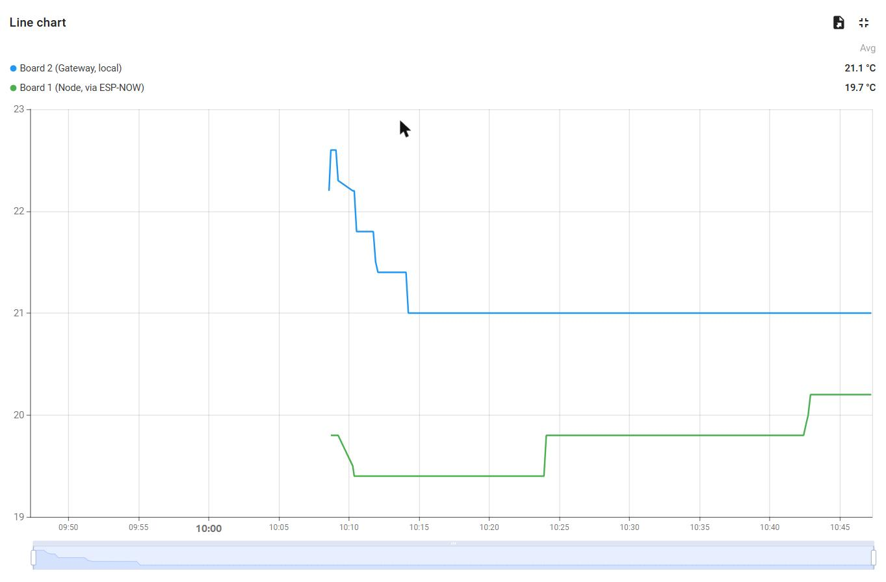

**Figure 5** — Both temperature traces on one axis. Blue is the gateway's local sensor; green
is the remote node, arriving via ESP-NOW. This is the clearest single visualisation of edge
aggregation: two physically separate sensors, one of which has no network connection of its
own, presented as a single cloud stream. The stepped appearance is DHT11 quantisation
(§9), not a frozen sensor.

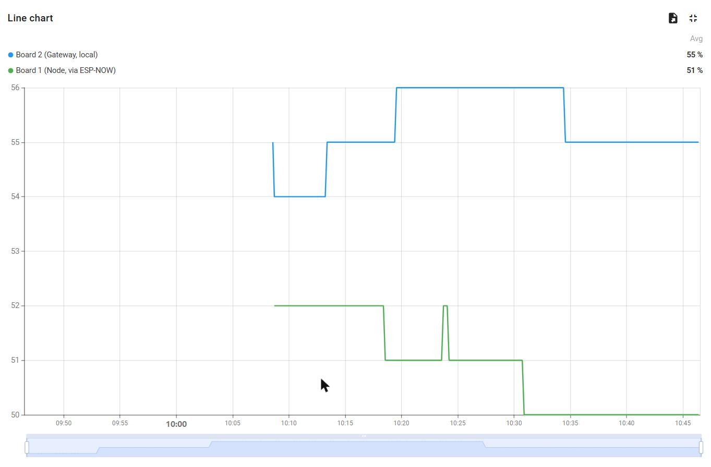

**Figure 6** — Both humidity traces. The same two sources, second measurand.

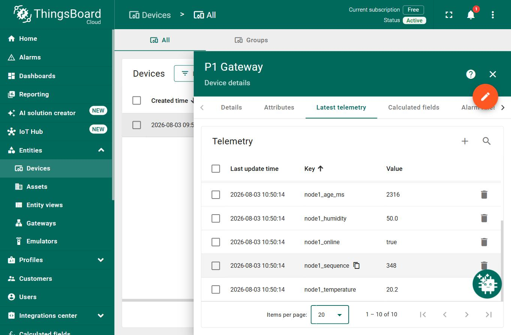

**Figure 7** — Latest telemetry, showing all ten published keys with timestamps. Both the
`gateway_*` and `node1_*` families are present in the same update, confirming that the merge
happens at the edge rather than in the cloud.

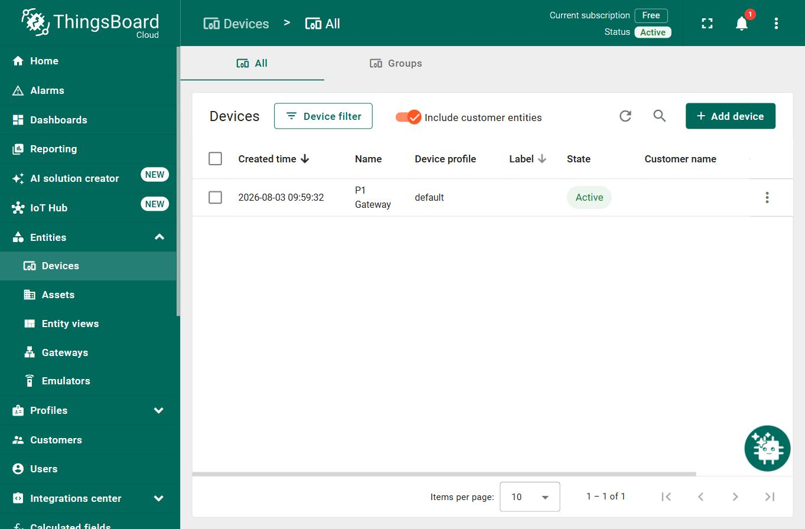

**Figure 8** — The device registered as **Active**. ThingsBoard sets this state only on a live
connection, so the badge is independent confirmation of cloud connectivity.

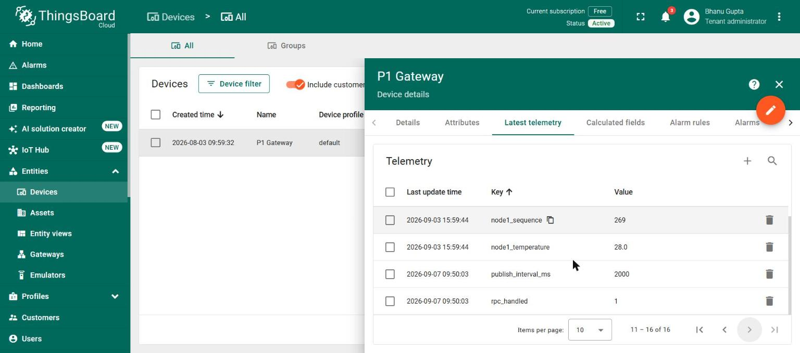

**Figure 9** — The result of a dashboard command, read back from the cloud. `publish_interval_ms`
is 2000 rather than the compiled-in default of 10000, and `rpc_handled` has incremented to 1.
Because these values are reported *by the device* in its own telemetry, they confirm the command
was received and applied, not merely that the dashboard sent it.

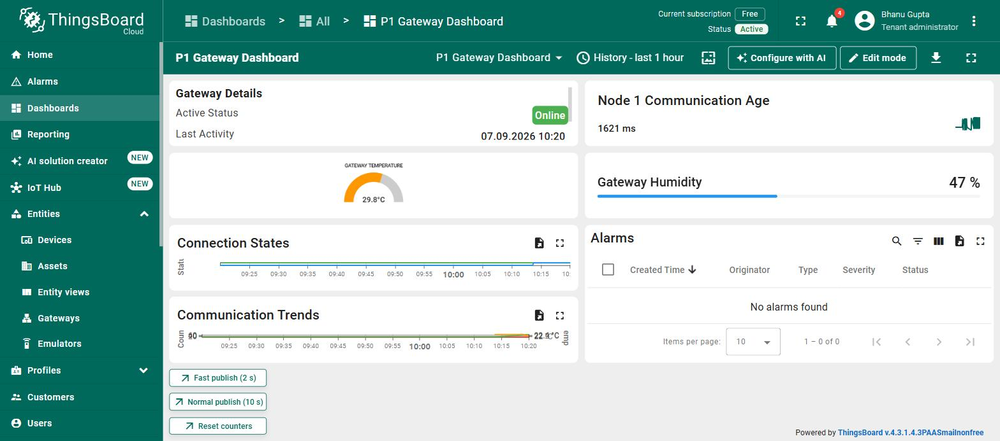

**Figure 10** — The complete system in operation. The gateway is **Online**, its own sensor reads
29.8 °C and 47 %, *Node 1 Communication Age* is counting in milliseconds rather than sitting
stale, no alarms are raised, and the three RPC command buttons are available to an operator.
This single view covers both directions of the link.

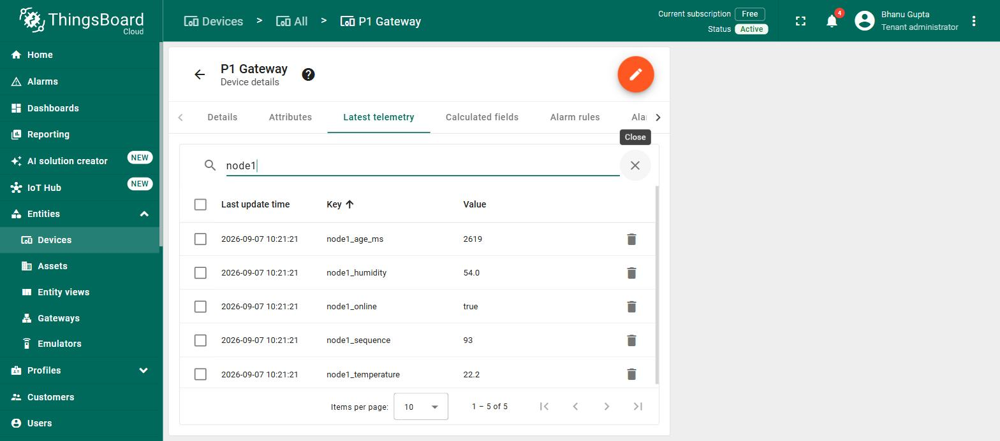

**Figure 11** — The cloud's view of the remote node, filtered to the `node1_*` keys. All five
share one timestamp and `node1_online` is `true`. These values originate on a board with no
network connection of its own; they reached the cloud only by ESP-NOW to the gateway and MQTT
onward, which is the central claim of the project reduced to five rows.

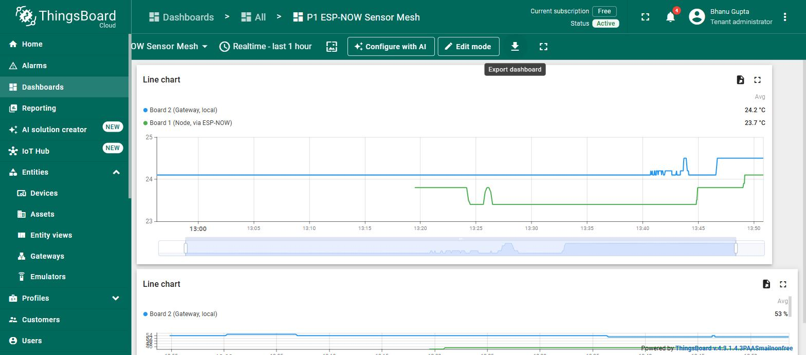

**Figure 12** — The second dashboard, *P1 ESP-NOW Sensor Mesh*, which exists to put the two
sources side by side rather than to summarise device health. Blue is Board 2's own sensor at
24.2 °C; green is Board 1, arriving by radio, at 23.7 °C. The green trace begins part way along
because that is when the link was restored after the channel roam described in §8.8 — the gap
is the outage, not a rendering artefact.

An animated capture of the dashboard responding to a command is included as
`evidence/video_01_thingsboard_rpc_demo.gif`: live telemetry, the *Fast publish (2 s)* button
being pressed, and `publish_interval_ms` and `rpc_handled` changing in the device's own
telemetry as a result.

---

## 9. Limitations

**One hop only.** Two radios cannot demonstrate multi-hop forwarding. The `ttl` and
`hop_count` fields are designed for but unexercised. Any claim of a working mesh would be
unsupported by the evidence collected.

**Sensor resolution.** The DHT11 quantises to roughly 1 °C, which is why the dashboard traces
appear as staircases rather than curves. The flat sections are quantisation artefacts, not a
frozen sensor. A higher-resolution sensor would produce more convincing charts without
changing anything else about the system.

**Sensor self-heating.** Board 2 consistently read 2–3 °C warmer than Board 1 early in
testing. Board 2 runs the enterprise Wi-Fi supplicant and an always-on radio, dissipating a
few hundred milliwatts within centimetres of its own sensor. The gap narrowed once both
boards reached thermal equilibrium, indicating the effect is a combination of genuine
self-heating, thermal lag, and DHT11 part-to-part tolerance (±2 °C rated).

**Security.** Set out in full in §7.9. The radio link is encrypted and sender-authenticated,
but MQTT runs without TLS so the access token crosses the network in clear text, RADIUS
certificates are not validated, and all credentials — including the ESP-NOW keys — are
compiled into flash and recoverable over USB.

**Blocking MQTT connection attempts.** `mqtt.connect()` is synchronous (§7.5). An unreachable
broker can occupy the main loop for seconds at a time, delaying queue draining and sensor
reads. No overflow was observed in testing, but the queue-overflow counter exists so that it
would be visible rather than silent.

**Buffering is bounded and volatile.** The store-and-forward ring holds twelve payloads —
about two minutes at the default cadence. A longer outage overwrites the oldest entries, which
is counted in `dropped_total` rather than hidden, but is still data loss. The buffer is in RAM,
so it survives a network outage but not a power cycle. Both are deliberate trades rather than
oversights, and §11 records what closing them would require.

**Manual channel configuration — observed, not hypothetical.** If the gateway roams to an
access point on a different channel, the ESP-NOW link stops working while Wi-Fi and MQTT
remain healthy.

This occurred during testing. The gateway associated on channel 1, and later roamed to a
different access point on channel 11 while the node remained pinned to channel 1. Delivery
stopped completely: `espnow_received_count` froze at zero, the node reported
`FAILED (no ack)` on every transmission, and the gateway continued publishing its own local
readings to the cloud without interruption. Every indicator that a casual observer would check
looked healthy.

The incident was diagnosed from the gateway's own boot banner, which reports the active
channel on every reconnection, and resolved by updating `ESPNOW_CHANNEL` in the node firmware
and re-uploading. Recovery took under two minutes but required physical access to the node.

It then recurred. Over a single day the gateway was observed on channels 1, 11 and 6 in turn,
and on the final occasion the node had been pinned to 6 while the gateway had settled back on
1 — the same silent failure, reached from the opposite direction. The recurrence is the point:
this is not a one-off mistake that care prevents, it is a standing property of running ESP-NOW
alongside a managed enterprise network, and any deployment on eduroam must either automate the
channel or accept a link that breaks whenever the access point decides it should.

Two lessons follow. First, this is the strongest argument in the project for the diagnostic
output described in §7.5 — without a gateway that reports its own channel, the failure
presents as "the remote sensor stopped working" with no indication of why. Second, it is the
reason the demonstration procedure begins by re-reading the channel in the room where the
demonstration will occur, rather than trusting a value recorded elsewhere.

**Single remote node.** The deduplication state is a single slot rather than an array indexed
by `src_id`. Supporting additional nodes would require that change, though it is a small one.

---

## 10. Findings

Three results measured during development rather than assumed.

**Outbound MQTT on port 1883 is permitted on the institutional network.** This was in doubt,
since campus networks commonly block non-web outbound ports. It was resolved by reading the
MQTT return code precisely: the observed failure was `state=5` (not authorised), which is a
reply *from the broker*, whereas `state=-2` would indicate the TCP connection never opened. A
reply proves the packets completed a round trip through the firewall. The failure was
therefore an authentication problem — a placeholder access token — not a connectivity one.
Distinguishing these two codes turned an ambiguous failure into a precise diagnosis.

**WPA2-Enterprise costs approximately 97 KB of flash.** The gateway sketch grew from 69 % to
77 % of the available partition when PEAP was enabled (915 KB → 1012 KB). Enterprise
authentication is not free, and on a smaller partition scheme this could be a genuine
constraint.

**eduroam authenticates by RADIUS realm, not by email domain.** Authentication failed with
the identity `user@student.<institution>` and succeeded with `user@<institution>`. eduroam
routes authentication requests to a RADIUS server based on the domain following the `@`; an
address that is valid for email is not necessarily a registered authentication realm. The
failure mode is silent — the connection simply times out with no diagnostic distinguishing it
from a wrong password.

---

## 11. Conclusion

The system meets all eleven acceptance criteria, with captured evidence for each. Two ESP32
boards, sharing no wired connection, deliver two independent sensor readings into a single
cloud telemetry stream, with duplicate rejection, liveness detection, and correct recovery
from restarts of either board.

The scope claim made in §1 is supported by the evidence and no further: this is a two-node
ESP-NOW prototype with a mesh-ready packet design. Multi-hop forwarding is designed for in
the packet format but is not demonstrated, and cannot be with two radios.

**Further work,** in rough order of value:

1. **A third node**, to actually exercise `ttl` and `hop_count` and turn the mesh-ready
   design into a demonstrated one.
2. **TLS MQTT on port 8883**, closing the one remaining plaintext path now that the radio
   link is encrypted.
3. **Credentials in NVS**, provisioned at first boot rather than compiled in — which would
   also remove the ESP-NOW keys from the firmware image.
4. **Over-the-air firmware update.** Currently every change requires physical access to both
   boards. This is the change with the greatest operational impact, since the channel-roam
   incident in §9 required exactly that physical access to resolve.
5. **Automatic channel recovery** — the node could scan for the gateway rather than being
   pinned to a hard-coded channel, which would have prevented that incident entirely.
6. **Flash-backed buffering**, so the store-and-forward queue survives power loss as well as
   network loss.
7. **A higher-resolution sensor** (SHT31, BME280) to remove the quantisation artefacts.

### 11.1 Reflection

**The hardest part was not the code — it was the network authentication.**

Connecting the gateway to the institutional eduroam network consumed more time than the
ESP-NOW protocol, the deduplication logic and the MQTT integration combined. The reason is
that its failure mode carries no diagnostic information. Authentication with the identity
`user@student.<institution>` failed with `WiFi.status() == 6` (`WL_DISCONNECTED`), which is
exactly the same status returned by a wrong password, a wrong SSID, or an out-of-range access
point. There is no error code distinguishing "this realm does not exist" from "these
credentials are wrong."

The resolution was to try the shorter realm `user@<institution>`, which connected within six
seconds. The underlying cause is that eduroam routes authentication requests to a RADIUS
server based on the domain following the `@`, and an address that is valid for *email* is not
necessarily a registered *authentication realm*. Most users never encounter this because their
device's Wi-Fi profile was configured for them by IT.

Two lessons follow. First, when a system offers no diagnostic, the fastest path is a
controlled experiment rather than more analysis — changing one variable and re-testing found
the answer in two upload cycles, where reasoning about it could have taken far longer. Second,
enterprise network authentication should be tested at the *start* of a project that depends on
it, not at the end. It was the last major integration step here and it could easily have
blocked everything.

**The second-hardest part was understanding a constraint rather than writing code.**

An ESP32 has one radio and therefore one channel. Because the gateway must associate with an
access point to reach the cloud, the access point *dictates* the gateway's channel — it is a
value discovered at runtime, not chosen at design time. The sensor node must then be pinned to
that same channel by hand.

This single fact determines the entire structure of the project: it is why the gateway must be
flashed and run before the node can even be configured, why the node deliberately never joins
the access point, and why the node reads its channel back after setting it. None of that is
obvious from the ESP-NOW documentation, which presents channel as a simple configuration
parameter. Recognising that it is a *discovered* value was the conceptual turning point in the
design.

**A trap avoided rather than a difficulty overcome.**

Arduino-ESP32 3.3.x is built on ESP-IDF 5.5, which changed both ESP-NOW callback signatures.
The widely published form taking a bare `const uint8_t *mac` does not compile against this
core. Rather than copying a tutorial, the installed `esp_now.h` was read directly before any
callback was written, and both sketches compiled without error on the first attempt as a
result. Had this been discovered by trial and error instead, it would have presented as an
obscure incompatible-pointer error with no obvious connection to the core version. Checking
the installed headers cost a few minutes and saved an unknown but probably large amount of
debugging.

**What we would do differently.**

1. **Test the network path first.** Wi-Fi association and an MQTT round trip should have been
   proved before any ESP-NOW code was written. Both turned out to be the risky parts —
   ESP-NOW itself worked on the first attempt.
2. **Pin the gateway to a specific access point by BSSID.** The institutional network has
   access points on channels 1, 6 and 11. If the gateway roams to a different channel, the
   ESP-NOW link silently dies while Wi-Fi and MQTT continue to look healthy — the worst kind
   of failure. The enterprise `WiFi.begin()` overload accepts a BSSID argument for exactly
   this purpose.
3. **Build the evidence-capture tooling earlier.** A serial monitor that attaches *without*
   resetting the board proved essential for observing accumulated state such as stale
   detection and packet counters. Standard serial monitors reset the board on connect, which
   destroys precisely the state being measured. This was written partway through testing and
   should have existed from the start.
4. **Provision credentials at runtime rather than at compile time.** Compiling institutional
   Wi-Fi credentials into the firmware means the board physically carries them and they are
   recoverable over USB. Storing them in NVS, entered once at first boot, would remove that
   exposure entirely.

**What we learned.**

The most transferable lesson is that in embedded networking, the difficult failures are the
*silent* ones. Three separate issues in this project would have produced no error message at
all: a mismatched ESP-NOW channel (sends report success, nothing arrives), Wi-Fi power save
parking the radio (intermittent loss resembling poor range), and an undersized MQTT buffer
(`publish()` returns `false` and nothing is transmitted). None would have thrown an exception
or logged a warning by default.

The defence against all three is the same, and it is the habit this project most reinforced:
**verify state rather than assume it**. Read the channel back after setting it. Print the
discovered channel rather than trusting the configured one. Check the return value of
`publish()`. Count invalid packets explicitly rather than assuming zero. Every diagnostic line
in the final firmware exists because it converts a silent failure into a visible one — and
during testing, several of them did precisely that.

> **[Both members]** Adjust the emphasis above to match your own experience, and add a
> sentence each on what you personally took from the project.

---

## Video evidence

The demonstration video is submitted with this portfolio rather than linked, so it needs no
external hosting and no sign-in to view.

**`P1_demo_cloud_and_hardware.mp4`** — 1280×720, 1 min 49 s, 7.0 MB. Also in the repository at
`evidence/P1_demo_cloud_and_hardware.mp4`.

| From | Segment | Contents |
|---|---|---|
| 0:00 | Title | |
| 0:05 | Hardware | Both boards on the bench, each separately powered, with no wire between them |
| 0:20 | Cloud | Gateway online, node communication age counting in milliseconds |
| 0:24 | Walkthrough | The RPC command sent and the device reporting the change back; the `node1_*` keys; both sensors on one chart |
| 0:57 | At the bench | The dashboard running beside the boards it reports on |
| 1:16 | Disconnection | Board 1's USB power pulled, the intervention behind §8.5 |
| 1:29 | Round trip | `publish_interval_ms` and `rpc_handled` after the command |
| 1:44 | Close | |

Subtitles are burned into the frames. The two source screen captures are also kept separately
as `evidence/video_02_thingsboard_walkthrough.gif` and `evidence/video_01_thingsboard_rpc_demo.gif`.

What the assembled video does **not** contain is the physical interventions: warming the sensor
by hand, and disconnecting and restoring Board 1. Those produce the results reported in §8.5
and §8.6 and are filmed separately. `VOICEOVER_SCRIPT.md` carries the narration script timed
against the segments above.

`DEMO_PLAN.md` in the repository carries the runsheet these recordings follow, including the
pre-flight checks and the intended order of the demonstration steps.

---

## Appendices

- **A** — Wiring tables (§2.2) and full pin assignments
- **B** — Serial capture logs: `evidence/01_` through `evidence/06_`
- **C** — Source code: five Arduino sketches, `secrets.example.h`, `build.ps1`
- **D** — ThingsBoard device setup and dashboard telemetry key reference (`README.md` §10)

### Telemetry key reference

| Key | Type | Meaning |
|---|---|---|
| `gateway_temperature` | number | Board 2 local DHT11, °C |
| `gateway_humidity` | number | Board 2 local DHT11, % RH |
| `gateway_sensor_ok` | boolean | Last local read succeeded |
| `node1_temperature` | number | Board 1 DHT11, °C, via ESP-NOW |
| `node1_humidity` | number | Board 1 DHT11, % RH, via ESP-NOW |
| `node1_sequence` | number | Sequence number of the last accepted packet |
| `node1_age_ms` | number | Milliseconds since the last valid packet |
| `node1_online` | boolean | False once `node1_age_ms` exceeds 20000 |
| `duplicate_count` | number | Packets rejected as duplicates since boot |
| `espnow_received_count` | number | Packets passing validation since boot |
| `buffered_now` | number | Payloads currently queued awaiting the broker |
| `buffered_total` | number | Payloads queued since boot |
| `dropped_total` | number | Payloads overwritten before they could be sent |
| `rpc_handled` | number | Server-to-device commands accepted |
| `publish_interval_ms` | number | Current telemetry cadence, settable by RPC |

### Server-to-device RPC methods

| Method | Params | Returns |
|---|---|---|
| `getStatus` | none | Liveness, counters, queue depth, interval, channel |
| `setPublishInterval` | milliseconds (2000–300000) | `{"ok":true,...}` or a rejection with the valid range |
| `resetCounters` | none | `{"ok":true,"reset":true}` |
