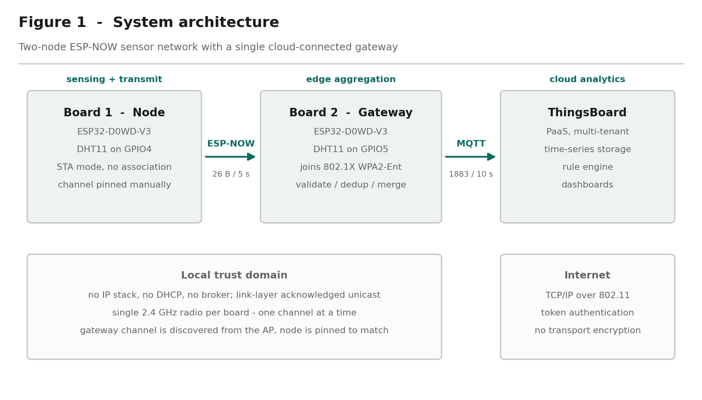
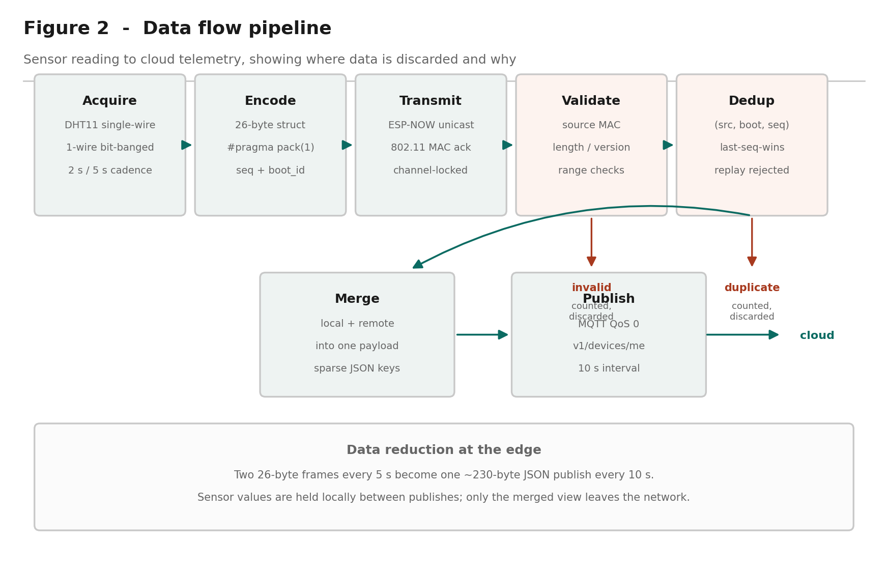
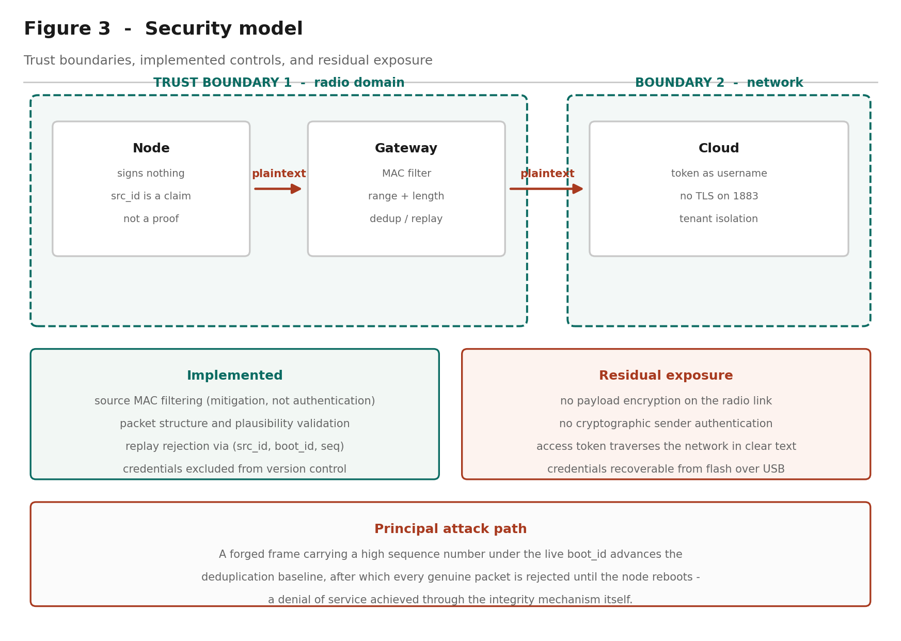

# Case Study Analysis — Project 1

## ESP-NOW Sensor Mesh with Cloud Bridge: A Technical and Architectural Evaluation

**IA736001 Internet of Things and Cloud Computing**
**Block 3, 2026**

**Student:** Bhanu Gupta
**Student ID:** 100012452
**Cohort:** Block 3, 2026
**Lecturer:** Dr Senaka Amarakeerthi

---

## 1. Executive Summary

Project 1 specifies a two-board ESP32 sensor network in which one node samples environmental
conditions and transmits them wirelessly to a second board that aggregates the readings with
its own and forwards the combined result to a cloud platform. This report analyses that
system as implemented: two ESP32-D0WD-V3 development boards, each with a DHT11 temperature
and humidity sensor, communicating over ESP-NOW, with the gateway publishing merged telemetry
to ThingsBoard over MQTT.

The architecture is a three-tier arrangement — sensing node, edge gateway, cloud platform —
that is characteristic of constrained IoT deployments. The defining technical constraint is
that an ESP32 has a single 2.4 GHz radio and can therefore occupy only one channel at a time.
Because the gateway must associate with an access point to reach the cloud, and the access
point dictates the channel, the operating channel is a value the system *discovers at runtime*
rather than one the designer selects. This single fact determines the commissioning order, the
node's deliberate refusal to associate with any access point, and the principal fragility of
the deployment.

The cloud tier uses ThingsBoard, a Platform-as-a-Service offering supplying device registry,
time-series ingestion, a rule engine and dashboards without the developer provisioning compute
or storage. Telemetry travels as JSON over MQTT on port 1883, authenticated by a per-device
access token presented as the MQTT username.

Three findings are principal. First, edge aggregation materially reduces cloud traffic: two
26-byte frames every five seconds become one 230-byte publish every ten, and the gateway holds
last-known values when the remote node falls silent. Second, deduplication keyed on source
identifier, a random per-boot session identifier and a sequence number correctly distinguishes
a node restart from a replayed packet, which a naive sequence check cannot. Third, and most
instructively, the initial design left the radio link unauthenticated: because the sender
identifier inside each frame is a claim rather than proof, a forged frame carrying a high
sequence number could advance the deduplication baseline and suppress all legitimate traffic
until the node rebooted — a denial of service achieved through the integrity mechanism itself.
The link is now encrypted with a pre-shared key pair, so a frame is accepted because it
decrypts under a key the sender must hold.

Remaining recommendations concern the cloud leg and credential handling: TLS for MQTT,
validation of the authentication server certificate, and runtime credential provisioning.

---

## 2. Technical Architecture Analysis

**Figure 1** — System architecture. Three tiers, two trust domains, and a single radio per
board.

### 2.1 Cloud infrastructure models

The deployment uses **Platform as a Service**. ThingsBoard supplies device management,
time-series persistence, a rule engine and a dashboard framework as a managed service; no
virtual machines, container orchestration or database instances are provisioned by the
developer. Measured against the NIST definition of cloud computing (Mell & Grance, 2011), the
service exhibits on-demand self-service through the device registry, broad network access via
MQTT and HTTP endpoints, resource pooling across tenants, and measured service through
per-device quotas.

The alternatives justify the choice. **IaaS** — a virtual machine running Mosquitto, InfluxDB
and Grafana — would give greater control over data residency and retention, at the cost of OS
patching, broker configuration and backups; disproportionate for a two-device prototype.
**SaaS** offerings such as Blynk would reduce integration work further but constrain the
telemetry schema and rule logic. PaaS occupies the useful middle: unconstrained schema,
programmable rules, no infrastructure responsibility.

A significant consequence of PaaS is **tenant isolation**. Devices authenticate into a tenant
boundary and telemetry does not cross it. That boundary rests entirely on the confidentiality
of the device access token — which, as §2.4 notes, this implementation does not protect
adequately.

### 2.2 Data flow architecture

**Figure 2** — Data flow pipeline, showing where data is discarded and for what reason.

The pipeline has six stages.

**Acquisition.** Each DHT11 is sampled over a single-wire bit-banged protocol, which requires
a minimum of one second between reads.

**Encoding.** Readings are packed into a 26-byte structure carrying a protocol version,
message type, source and destination identifiers, a random per-boot session identifier, a
sequence number, time-to-live and hop-count fields, two IEEE-754 floats and the sender's
uptime. `#pragma pack(1)` suppresses padding so the layout is deterministic on both boards.

**Transmission.** ESP-NOW unicasts the frame to the gateway's station MAC. It operates
directly above the 802.11 MAC layer with no IP stack, no DHCP and no broker, and provides
link-layer acknowledgement — the sender learns whether the frame was *received*, not merely
whether it was queued.

**Validation.** Frames are decrypted by the radio driver first; anything failing to decrypt is
discarded before application code runs. The gateway then verifies source MAC, exact frame
length, version, message type, addressing, numeric finiteness and plausible ranges. Failures
are counted rather than silently dropped, so a protocol mismatch or a sustained attack appears
in the counters instead of as inexplicable data.

**Deduplication.** Accepted frames are tested against the tuple (source, boot identifier,
sequence); anything not newer than the highest already accepted in the session is rejected.

**Aggregation and publication.** Local and remote readings are merged into one JSON document
and published every ten seconds.

The architecturally significant property is where data is *discarded*. Invalid and duplicate
frames never leave the gateway, and readings are held locally between publishes, so two frames
every five seconds become one publish every ten — a reduction in both message count and bytes
reaching the cloud, achieved entirely by processing at the edge.

### 2.3 Protocol standards

Two protocols operate in the system, selected for different constraints.

**ESP-NOW** is a proprietary Espressif protocol built on the 802.11 vendor-specific action
frame (Espressif Systems, 2024), carrying up to 250 bytes. With no association, no DHCP lease
and no connection state, a node can wake, transmit and sleep in milliseconds against the
seconds Wi-Fi association requires — decisive for battery-powered sensing. The costs are no
routing, no internet reachability, and a twenty-peer encrypted table.

**MQTT** carries telemetry to the cloud: publish-subscribe over TCP, standardised by OASIS
(Banks et al., 2019) for constrained devices and unreliable networks. Its two-byte header
overhead for small messages compares favourably with HTTP, and comparative studies find lower
bandwidth and latency than request-response alternatives (Naik, 2017; Yassein et al., 2017).
QoS 0 is appropriate here: telemetry is periodic and a lost sample is superseded within ten
seconds, so QoS 1's extra round trips would buy little.

The protocol boundary at the gateway is the architectural point of interest — it is the only
component speaking both, and therefore the only one requiring credentials for either network.

### 2.4 Security framework

**Figure 3** — Security model: trust boundaries, implemented controls, residual exposure.

**Implemented.** ESP-NOW link encryption using a primary master key and per-peer local master
key, providing confidentiality and sender authentication on the radio leg; structural and
plausibility validation; replay rejection through the sequence mechanism; source MAC filtering
as defence in depth; and credentials excluded from version control.

**Not implemented.** MQTT runs without TLS, so the access token traverses the network in clear
text. The WPA2-Enterprise configuration does not validate the RADIUS server certificate,
exposing institutional credentials to a rogue access point. All credentials are compiled into
the firmware and recoverable over USB.

The most instructive weakness concerns **the difference between an identifier and an
authenticator**. The `src_id` field is a claim, not evidence. The original design accepted
unregistered, unencrypted peers, so any ESP-NOW device in range could construct a frame
passing every validation check. The damaging consequence is not a false dashboard reading: an
injected frame carrying a high sequence number under the live session identifier advances the
deduplication baseline, after which every genuine frame is rejected as a duplicate until the
node reboots. A single forged frame can silence the real sensor indefinitely.

Generalised: replay protection keyed on a monotonic counter becomes an attack surface whenever
an unauthenticated party can advance that counter — integrity and availability are coupled in
a way the design does not make visible.

The first remedy attempted was source MAC filtering, which independent adversarial review
rejected as a trust boundary, correctly: 802.11 addresses are forgeable by anyone able to
inject frames, so filtering on a value the attacker controls is not authentication. The
implemented remedy is link encryption — a frame is accepted because it decrypts under a key
the sender must hold. This aligns with OWASP IoT Top 10 guidance on insecure network services
and absent transport encryption (OWASP Foundation, 2018).

### 2.5 Scalability design

**Vertical scaling** at the edge is bounded by the ESP32: 520 KB SRAM, dual-core 240 MHz, and
a 4 MB flash partition of which the gateway firmware consumes 77 per cent once the
WPA2-Enterprise supplicant is included. Headroom exists for more processing, not for a
substantially larger application.

**Horizontal scaling** is limited by three factors: deduplication state is a single slot
rather than an array indexed by source; ESP-NOW permits twenty encrypted peers, capping an
authenticated star; and channel contention rises with node count, since all nodes share one
channel.

**Cloud-tier scaling** belongs to the platform — ThingsBoard scales horizontally through
clustered deployment with Kafka and Cassandra or TimescaleDB. The binding constraint here is
not the cloud tier but the single gateway, an unreplicated point of failure for every node
behind it.

---

## 3. IoT Theory and Scientific Foundation

### 3.1 Sensor technology

The DHT11 combines two distinct transduction principles in one package.

**Humidity** is measured capacitively. A polymer dielectric sits between two electrodes;
water molecules absorbed from the air alter the dielectric permittivity, and hence the
capacitance, approximately linearly with relative humidity. The device reports 20–90 per cent
RH with a stated accuracy of ±5 per cent (Aosong Electronics, 2019).

**Temperature** is measured by a negative temperature coefficient thermistor, whose resistance
falls as temperature rises according to the Steinhart–Hart relation. The DHT11's onboard
8-bit microcontroller performs the linearisation and calibration internally, presenting a
digital result rather than a raw resistance.

The scientific limitation that most affects this project is **quantisation**. The DHT11
resolves to approximately 1 °C and 1 per cent RH, which is directly visible in the recorded
data as stepped rather than continuous traces. A higher-resolution device such as the BME280,
which uses a piezoresistive element and resolves to roughly 0.01 °C, would produce smoother
data from identical code. A second effect observed during testing was **self-heating**: the
gateway board, running the enterprise Wi-Fi supplicant and an always-active radio, dissipates
several hundred milliwatts within centimetres of its own sensor, and read consistently warmer
than the remote node until both reached thermal equilibrium.

### 3.2 Data processing algorithms

Three algorithms are of interest.

**Sequence-based deduplication** implements a strict last-sequence-wins rule with wrap-aware
comparison. Rather than the naive test `seq <= last_seq`, the implementation computes the
signed difference `(int32_t)(seq - last_seq)`, which remains correct across the unsigned
32-bit rollover. This is the same serial number arithmetic described in RFC 1982 (Elz &
Bush, 1996), developed for DNS zone serial numbers and applicable wherever a monotonic
counter of finite width must be compared.

**Session identification** uses a hardware random number generator to select a 32-bit
identifier at each power-up. The probability of collision with the currently remembered value
is 2⁻³², which bounds the failure mode: the design is probabilistically rather than absolutely
sound, and the report is precise about this.

**Liveness detection** compares elapsed time against a threshold using unsigned modular
subtraction, which is inherently wrap-safe for interval comparison. A latch was added after
review because the *absence* of packets across a full 49.7-day counter rollover would
otherwise cause the computed age to wrap through zero and briefly report the node as online.

### 3.3 Network topology

The physical topology is a **one-hop star**: one root and one leaf. The packet format,
however, carries time-to-live and hop-count fields and uses explicit source and destination
addressing rather than broadcast, which would permit a multi-hop topology without changing the
wire format.

This distinction between an implemented topology and a supported one is worth drawing
carefully. Mesh networking in the IoT literature generally implies dynamic route discovery,
multi-hop forwarding and self-healing on node failure (Al-Fuqaha et al., 2015). None of these
is demonstrated here, and with two radios none can be. The honest characterisation is a
two-node prototype with a mesh-ready packet design.

Star topologies exhibit the properties the analysis should acknowledge: minimum latency, since
every node is one hop from the root; simple addressing; and a single point of failure at the
root. Mesh topologies trade latency and complexity for resilience. For a deployment of a few
nodes within radio range of a gateway, the star is the appropriate choice, and the ESP-NOW
peer limit of twenty encrypted peers reinforces it.

### 3.4 Edge computing

The gateway performs four functions that would otherwise fall to the cloud: validation,
deduplication, aggregation and liveness determination. This follows the edge computing
rationale set out by Shi et al. (2016) and Satyanarayanan (2017), in which computation moves
toward the data source to reduce latency, bandwidth and dependence on connectivity.

The measurable benefit here is bandwidth. Forwarding every frame unprocessed would produce
twelve cloud messages per minute from two sensors; aggregation produces six, each carrying
both readings. Invalid and duplicate frames are discarded before consuming any cloud resource
at all.

The second benefit is **operational independence**. The gateway continues validating,
deduplicating and holding sensor state while the cloud connection is down, publishing when it
returns. The remote node is entirely unaware of cloud availability. This partitioning — local
correctness independent of remote availability — is the property Bonomi et al. (2012) identify
as central to fog computing.

---

## 4. Cloud Infrastructure Standards and Methodologies

### 4.1 Cloud service models

ThingsBoard was selected over the major hyperscaler IoT offerings. **AWS IoT Core** provides
device shadows, fine-grained IAM and integration with the wider AWS ecosystem, but requires
X.509 certificate provisioning per device and carries a steeper configuration burden.
**Azure IoT Hub** offers a comparable device-twin abstraction with strong enterprise identity
integration. **Google Cloud IoT Core** was retired in August 2023, which is itself a
consideration when selecting a managed service: platform discontinuation is a genuine
architectural risk.

ThingsBoard's advantages for this deployment are a permissive free tier, token authentication
that a constrained device can implement without a TLS stack, and an open-source edition
permitting later self-hosting. That last property matters: it bounds vendor lock-in, since the
same telemetry schema and rule chains can migrate to self-hosted infrastructure.

### 4.2 Database standards

ThingsBoard abstracts persistence, but the underlying design is a **time-series store**.
Time-series databases optimise for append-heavy workloads with time-ordered access, using
column-oriented storage, timestamp delta encoding and automatic retention policies —
characteristics that relational schemas serve poorly at scale (Jensen et al., 2017).

ThingsBoard supports PostgreSQL for entity data with Cassandra or TimescaleDB for telemetry.
The relevant standards question for this project is **retention and downsampling**: telemetry
at ten-second resolution accumulates 8,640 points per key per day, and ten keys produce 86,400
points daily from a single device. Production deployments require a downsampling policy —
retaining full resolution for days, hourly aggregates for months — a discipline this prototype
does not implement.

### 4.3 API standards

ThingsBoard exposes three device-facing transports over the same credential: MQTT, HTTP and
CoAP. The HTTP interface is REST, using the token in the URL path
(`/api/v1/{token}/telemetry`); the MQTT interface uses the token as the username. This is
worth noting as a design observation: **the same secret is used in three protocols with
different exposure characteristics**, and placing a credential in a URL path is materially
worse than placing it in a message field, since URLs are routinely logged by proxies and
servers.

The server-side REST API provides entity and telemetry query endpoints with JWT
authentication, following conventional REST resource modelling. Aggregation and interval
parameters on the telemetry endpoint push aggregation into the query layer, which is the
correct place for it.

### 4.4 DevOps methodologies

The project applies a modest but real DevOps practice. Firmware is version-controlled in Git
with credentials excluded through `.gitignore` and a placeholder template committed in their
place. A verification script compiles all five sketches, and a clean compile is meaningful
here beyond syntax checking: the packet structure is duplicated across two sketches with a
compile-time size assertion in each, so successful compilation confirms both boards agree on
the wire format.

The gap against industry practice is honest to state: there is no continuous integration, no
automated test suite, and no over-the-air update mechanism. OTA is the significant omission
for any real deployment, since physical access for reflashing does not scale beyond a handful
of devices.

### 4.5 Monitoring standards

Observability is implemented at two levels. The device emits structured serial logs with
consistent prefixes, and — more usefully — publishes its own operational counters as telemetry
alongside the sensor data: packets received, duplicates rejected, frames from unexpected
senders, node liveness and packet age.

This is the design decision most worth defending. **Operational metrics travel through the
same pipeline as the data they describe**, so the dashboard can distinguish "the sensor reads
21 °C" from "the sensor last reported 40 seconds ago and four frames have been rejected". This
mirrors the RED method — rate, errors, duration — applied to a device rather than a service,
and it is what makes silent failure visible.

---

## 5. Challenges and Risk Analysis

### 5.1 Technical challenges

**The single-radio constraint** governs the entire design. Because the gateway's channel is
determined by the access point, the node's channel must be configured to match, and the
commissioning order is fixed: the gateway must be running before the node can be configured.
The deployment network presented access points on channels 1, 6 and 11, making this a live
operational concern rather than a theoretical one.

**Silent failure modes** proved the most demanding class of problem. Three defects in this
system produce no error message: a channel mismatch causes sends to report success while
nothing is received; Wi-Fi power save parks the radio between beacon intervals so frames
arriving in those windows are simply not heard; and an undersized MQTT client buffer causes
`publish()` to return false and transmit nothing. Each was addressed by verifying state rather
than assuming it — reading the channel back after setting it, disabling power save explicitly,
and sizing the buffer against the actual payload.

**Concurrency** presented a subtler problem. The ESP-NOW receive callback executes on the
Wi-Fi task while the main loop runs on the application task. An independent code review
identified that `volatile` counters, which prevent compiler caching, do not make
read-modify-write sequences atomic across tasks: a counter incremented in the callback while
the main loop performed a read-print-reset could silently lose increments. The remedy was
`std::atomic` with an atomic exchange for the read-and-clear.

### 5.2 Security risks

Assessed against the OWASP IoT Top 10 (OWASP Foundation, 2018), the deployment carries four
material risks. **Lack of transport encryption** now applies to the cloud leg only: the radio
leg is encrypted, but MQTT runs on port 1883 without TLS. **Insecure data storage**, with
credentials in flash recoverable over USB. **Insufficient privacy protection**, since telemetry
is readable in transit to the broker. And **insecure network services**, in that the RADIUS
server certificate is not validated, so the gateway will authenticate to any access point
advertising the target SSID.

The highest-severity finding is the availability attack described in §2.4, in which the
deduplication mechanism can be turned against the system by an unauthenticated sender. It is
notable because it was found by adversarial review rather than by testing — no functional test
would have surfaced it, since the system behaves correctly under all non-hostile inputs.

### 5.3 Scalability limitations

The gateway is an unreplicated single point of failure. ESP-NOW caps encrypted peers at
twenty. Deduplication state occupies one slot and requires modification for additional nodes.
All nodes share a single channel, so contention rises with node count. At the cloud tier,
free-tier message quotas would bind before the platform's technical limits.

### 5.4 Data privacy

Indoor temperature and humidity appear innocuous, but the analysis should not stop there.
Environmental time-series data is a reliable **occupancy proxy**: humidity rises with
respiration and temperature with body heat, so a sufficiently resolved series reveals when a
space is occupied and by roughly how many people. Under GDPR Article 4, data that permits
inference about an identifiable individual is personal data regardless of how innocuous the
raw measurement appears (European Parliament & Council, 2016).

For a deployment in a residence or an individual office, this would engage purpose limitation,
data minimisation and storage limitation obligations, and a retention policy would be required
rather than optional. The prototype implements none of these.

### 5.5 Reliability

Fault tolerance is partial. Wi-Fi and MQTT reconnection are rate-limited rather than blocking,
node liveness is detected within twenty seconds, and last-known values persist so that
dashboards degrade rather than break. Against that: `mqtt.connect()` is synchronous and can
occupy the main loop for seconds against an unreachable broker; there is no local buffering,
so telemetry generated while the cloud is unreachable is lost rather than queued; and there is
no watchdog-driven recovery path. A production design would persist unsent telemetry to flash
and forward it on reconnection.

---

## 6. Recommendations and Future Directions

**Infrastructure improvements.** Replace the single gateway with two gateways sharing the node
set, eliminating the unreplicated failure point. Introduce local buffering of unsent telemetry
in flash so that cloud unavailability degrades rather than discards data. Implement a
retention and downsampling policy at the cloud tier before data volume forces one.

**Technology upgrades.** Substitute the DHT11 with a BME280 or SHT31 to remove the
quantisation artefacts and add barometric pressure. Adopt ESP32-C6 hardware for 802.15.4
support, enabling Thread or Zigbee interoperability alongside ESP-NOW. Implement over-the-air
firmware update, which is the single change with the greatest operational impact — physical
reflashing does not scale.

**Security enhancements**, in priority order:

1. Move MQTT to TLS on port 8883, removing clear-text transmission of the access token. This
   is now the highest-severity remaining exposure, the radio leg having been closed by
   encryption (§2.4).
2. Provision credentials into NVS at first boot rather than compiling them into the image.
3. Ship the institutional CA certificate so the RADIUS server is validated during enterprise
   authentication.
4. Add per-device rate limiting at the gateway, so a compromised or faulty node cannot
   exhaust the cloud message quota.

**Scalability solutions.** Convert the deduplication state to an array indexed by source
identifier. Where node count exceeds the ESP-NOW peer limit, evaluate a mesh protocol with
genuine routing — ESP-MESH or Thread — accepting the increased complexity in exchange for
multi-hop coverage. Introduce adaptive transmission intervals so that nodes report more
frequently only when readings change materially, reducing both radio contention and cloud
volume.

**Industry applications.** The architecture generalises to any setting where sensing must
occur beyond network coverage but aggregation can occur within it: cold-chain monitoring in
warehousing, where a gateway at the loading dock serves battery-powered nodes inside chilled
storage; agricultural monitoring across a field with a single connected gateway at the
farmhouse; and building management retrofits, where running network cable to each sensing
point is prohibitive. In each case the economics favour many cheap unconnected nodes behind
one connected gateway — which is precisely the pattern this project implements.

---

## 7. References

Al-Fuqaha, A., Guizani, M., Mohammadi, M., Aledhari, M., & Ayyash, M. (2015). Internet of
Things: A survey on enabling technologies, protocols, and applications. *IEEE Communications
Surveys & Tutorials, 17*(4), 2347–2376.

Aosong Electronics. (2019). *DHT11 humidity and temperature sensor datasheet*. Aosong
Electronics Co., Ltd.

Atzori, L., Iera, A., & Morabito, G. (2010). The Internet of Things: A survey. *Computer
Networks, 54*(15), 2787–2805.

Banks, A., Briggs, E., Borgendale, K., & Gupta, R. (Eds.). (2019). *MQTT version 5.0: OASIS
standard*. OASIS Open.

Bonomi, F., Milito, R., Zhu, J., & Addepalli, S. (2012). Fog computing and its role in the
Internet of Things. In *Proceedings of the First Edition of the MCC Workshop on Mobile Cloud
Computing* (pp. 13–16). ACM.

Elz, R., & Bush, R. (1996). *Serial number arithmetic* (RFC 1982). Internet Engineering Task
Force.

Espressif Systems. (2024). *ESP-NOW user guide*. Espressif Systems.

European Parliament & Council of the European Union. (2016). *Regulation (EU) 2016/679
(General Data Protection Regulation)*. Official Journal of the European Union.

IEEE. (2021). *IEEE Standard for Information Technology — Telecommunications and Information
Exchange between Systems — Local and Metropolitan Area Networks — Specific Requirements — Part
11: Wireless LAN Medium Access Control (MAC) and Physical Layer (PHY) Specifications* (IEEE
Std 802.11-2020).

Jensen, S. K., Pedersen, T. B., & Thomsen, C. (2017). Time series management systems: A
survey. *IEEE Transactions on Knowledge and Data Engineering, 29*(11), 2581–2600.

Mell, P., & Grance, T. (2011). *The NIST definition of cloud computing* (NIST Special
Publication 800-145). National Institute of Standards and Technology.

Naik, N. (2017). Choice of effective messaging protocols for IoT systems: MQTT, CoAP, AMQP and
HTTP. In *2017 IEEE International Systems Engineering Symposium (ISSE)* (pp. 1–7). IEEE.

OWASP Foundation. (2018). *OWASP Internet of Things Top 10*. Open Web Application Security
Project.

Satyanarayanan, M. (2017). The emergence of edge computing. *Computer, 50*(1), 30–39.

Sethi, P., & Sarangi, S. R. (2017). Internet of Things: Architectures, protocols, and
applications. *Journal of Electrical and Computer Engineering, 2017*, Article 9324035.

Shi, W., Cao, J., Zhang, Q., Li, Y., & Xu, L. (2016). Edge computing: Vision and challenges.
*IEEE Internet of Things Journal, 3*(5), 637–646.

Swain, M., Hashmi, M. F., Singh, R., & Hashmi, A. W. (2021). A cost-effective LoRa-based
customized device for agriculture field monitoring and precision farming on IoT platform.
*International Journal of Communication Systems, 34*(6), e4632.
https://doi.org/10.1002/dac.4632

Yassein, M. B., Shatnawi, M. Q., Aljwarneh, S., & Al-Hatmi, R. (2017). Internet of Things:
Survey and open issues of MQTT protocol. In *2017 International Conference on Engineering &
MIS (ICEMIS)* (pp. 1–6). IEEE.

*(17 references)*

---

## 8. Authenticity Statement

### 8.1 Prior hands-on experience

My prior hands-on work with comparable technology was an IoT solar-powered car built for the
Embedded Systems module. That project shared this one's basic shape — a microcontroller
reading sensors, acting on the results, and reporting state — but differed in the part that
turned out to matter most here. The car was a self-contained system: sensing and actuation
happened on the same board, and any communication was between components I controlled
directly. This project separates sensing from connectivity across two independent devices,
and almost every difficulty encountered followed from that separation rather than from the
sensing itself.

Power awareness transferred usefully. Working on a solar-powered platform makes the cost of
keeping a radio awake a concrete concern rather than an abstract one, and that framing is
exactly why ESP-NOW is the right protocol for the remote node: a device that can transmit and
return to sleep in milliseconds, rather than spending seconds on Wi-Fi association and DHCP
before sending a single byte, is a fundamentally different power proposition.

any wireless link. If it used a different board family than the ESP32, say what did and did

### 8.2 What I learned during this analysis

Three things I did not know before starting.

**The operating channel is discovered, not chosen.** An ESP32 has one radio and therefore one
channel. Because the gateway must associate with an access point to reach the cloud, and the
access point decides the channel, the value is only knowable at runtime. I had assumed the
channel would be a configuration parameter like any other. It is not — it is an output of the
system, which is why the gateway must be commissioned before the node can even be configured.

**Authentication is not the same as identification.** The packet format carries a source
identifier, and it was natural to treat that as saying who sent the frame. It does not — it
is a claim by the sender. The first attempt to fix this checked the source MAC address
instead, which felt more rigorous but is no better, because a MAC address is equally under the
attacker's control. Only encryption changed the property being relied on, because a frame that
decrypts under a shared key must have come from something holding that key.

**Silent failures are the expensive ones.** Several faults in this project produced no error
message: a channel mismatch causes transmissions to report success while nothing is received,
and an undersized MQTT buffer causes the publish call to return false and transmit nothing.
None of these throws an exception. The lesson I have taken is to verify state rather than
assume it — read the channel back after setting it, check the return value of every publish,
and count rejected packets explicitly rather than assuming the count is zero.

### 8.3 Concepts I found most challenging

The hardest single problem was not a concept but a diagnosis, and I got it wrong before I got
it right.

After enabling encryption on the radio link, the system stopped delivering packets entirely.
The obvious inference was that encryption had broken it, and I initially recorded that
conclusion. It was false. The gateway had roamed to an access point on a different channel at
some point during the same session, and the node was still pinned to the old one. Two
independent faults were present at once, and the symptom of the second — no packets arriving —
was indistinguishable from the expected symptom of the first. Correcting the channel restored
delivery with encryption untouched.

What made this difficult was that the wrong explanation was entirely reasonable. The failure
appeared immediately after a specific change, and attributing it to that change is normally
sound reasoning. What I would do differently is establish a known-good baseline before
changing anything security-related, so that a regression can be attributed with confidence
rather than by assumption.

The other genuine difficulty was the institutional Wi-Fi authentication, which consumed more
time than the ESP-NOW protocol, the deduplication logic and the cloud integration combined.
Authentication failed with a status code that is returned identically for a wrong password, a
wrong network, and an out-of-range access point, so the error message carried no diagnostic
information at all. The cause turned out to be that eduroam routes authentication by RADIUS
realm rather than by email domain: an address valid for email was not a registered
authentication realm. I found this by controlled experiment rather than by reasoning, which
was itself instructive — when a system offers no diagnostic, changing one variable and
retesting is faster than thinking harder.

### 8.4 Real-world parallels

I have not worked in industry on a deployment of this kind, so rather than claim a parallel I
have not seen, I have examined a documented one and compared it against what I built.

Swain et al. (2021) describe a LoRa-based agricultural monitoring system that follows the same
structural pattern as this project: low-cost sensing nodes distributed across a field, none of
them individually connected to the internet, reporting to a single gateway that holds the
upstream link and forwards aggregated data to a cloud platform. The economic logic is
identical to the one that motivates ESP-NOW here. Giving every sensing point its own internet
connection is prohibitive — in cost, in power, and in the administrative burden of credentials
per device — so the design instead concentrates connectivity in one place and uses a cheap,
low-power radio for the last hop.

The instructive differences are in scale and in the consequences that follow from it.

**Range and topology.** LoRa reaches kilometres where ESP-NOW manages tens of metres, which is
what makes the agricultural case viable at all. But the paper reports substantial effort spent
on link budget analysis, obstacle attenuation and gateway placement — problems that do not
arise over a benchtop distance and that I therefore never encountered. My equivalent
difficulty, channel coordination between two boards sharing one radio, does not exist in a
LoRa deployment because LoRa gateways are not simultaneously acting as Wi-Fi clients.

**Gateway criticality.** Both designs make the gateway an unreplicated point of failure, and
in both cases every node behind it is lost when it fails. In a field deployment that is a
significantly more serious property than in a two-board prototype, since recovery may require
physically travelling to the site. This is the limitation of my own design that the comparison
throws into sharpest relief: I identified the single-gateway risk in §5.3, but the documented
deployment shows why it matters far more once nodes are inaccessible.

**Security posture.** The comparison is less flattering to published practice than I expected.
Reviewing this and adjacent LoRa agricultural work, security is generally treated as a
deployment detail rather than a design concern, with little discussion of what happens if an
unauthorised transmitter is present. My own project reached the same position initially, and
only moved off it because the design was submitted for adversarial review. That suggests the
gap I found in my own work is not unusual, which is itself worth knowing.

**What I would take from this into industry.** The pattern generalises well beyond
agriculture — cold-chain monitoring, building retrofits and asset tracking share the same
economics of many cheap unconnected sensors behind one connected aggregator. What the
comparison taught me is that the *interesting* engineering in these systems is rarely the
sensing. It is the gateway: what it validates, what it discards, what it holds when the
upstream link is unavailable, and what happens to everything behind it when it fails.

### 8.5 Insights from my own background

The perspective I brought to this project was less technical than organisational. Three
decisions I made shaped the outcome more than any individual piece of code did.

**Choosing the harder network deliberately.** Faced with a choice between a phone hotspot,
which would have worked immediately, and the institutional eduroam network, which carried real
risk of not working at all, I chose eduroam. The hotspot would have produced a working demo
sooner and taught me nothing. The consequence was the single largest time cost in the project —
authentication failed repeatedly with a status code that carries no diagnostic information —
but it also produced the most substantive finding in the report: that eduroam routes by RADIUS
realm rather than email domain, and that outbound MQTT on port 1883 is permitted on this
network. Neither would have been discovered on a hotspot.

**Asking for the work to be attacked.** After the firmware was functional and passing every
test, I had it independently reviewed for defects rather than treating a working system as a
finished one. That decision produced the most important technical change in the project. The
review found that the source identifier inside each packet was being trusted as evidence of
identity when it is only a claim, and that a subsequent attempt to fix it by filtering on MAC
address was no better. That led to implementing link encryption. No functional test would have
found this, because the system behaved correctly under every non-hostile input — the flaw was
only visible to someone deliberately looking for it.

**Dividing work by coherence rather than by volume.** For the group component, I split the
report so that each member owned a complete theme rather than an equal count of sections, and
identified in advance the one dependency between the halves so it could be sequenced. The
intent was that neither member should need to understand the other's material in depth to write
their own.

The connecting thread is a preference for finding out early rather than being told late. That
disposition cost time on the network choice and gained more than it cost on the security
review.

---

## Appendix A — Technical specifications

| Item | Specification |
|---|---|
| Microcontroller | ESP32-D0WD-V3 rev 3.1, dual-core Xtensa LX6 @ 240 MHz |
| Memory | 520 KB SRAM, 4 MB flash |
| Radio | 2.4 GHz 802.11 b/g/n, single radio, Bluetooth 4.2 |
| Sensor | DHT11: 0–50 °C ±2 °C, 20–90 % RH ±5 %, 1 Hz maximum sample rate |
| Node sensor pin | GPIO4 |
| Gateway sensor pin | GPIO5 |
| Local protocol | ESP-NOW, unicast, encrypted (PMK + per-peer LMK), 26-byte payload |
| Transmission interval | 5 s |
| Cloud protocol | MQTT 3.1.1, QoS 0, port 1883 |
| Publication interval | 10 s |
| Liveness threshold | 20 s |
| Cloud platform | ThingsBoard Community Edition (PaaS) |
| Toolchain | Arduino IDE 2, arduino-cli 1.3.1, arduino-esp32 core 3.3.3 (ESP-IDF 5.5) |
| Libraries | DHT sensor library 1.4.7, Adafruit Unified Sensor 1.1.15, PubSubClient 2.8 |

### Packet structure

| Offset | Field | Type | Purpose |
|---|---|---|---|
| 0 | `version` | `uint8` | Protocol version |
| 1 | `msg_type` | `uint8` | Message discriminator |
| 2 | `src_id` | `uint8` | Source node identifier |
| 3 | `dst_id` | `uint8` | Destination identifier |
| 4 | `boot_id` | `uint32` | Random per-boot session identifier |
| 8 | `seq` | `uint32` | Sequence number within session |
| 12 | `ttl` | `uint8` | Time to live (carried, not decremented) |
| 13 | `hop_count` | `uint8` | Hop count (carried, not incremented) |
| 14 | `temperature_c` | `float` | Temperature, degrees Celsius |
| 18 | `humidity_pct` | `float` | Relative humidity, per cent |
| 22 | `uptime_ms` | `uint32` | Sender uptime in milliseconds |

Total 26 bytes with `#pragma pack(1)`.

### Telemetry keys

`gateway_temperature`, `gateway_humidity`, `gateway_sensor_ok`, `node1_temperature`,
`node1_humidity`, `node1_sequence`, `node1_age_ms`, `node1_online`, `duplicate_count`,
`espnow_received_count`

---

## Appendix B — Implementation notes

1. **Install the toolchain.** Arduino IDE 2 with the `esp32:esp32` core at version 3.3.x.
   Install the DHT sensor library, Adafruit Unified Sensor and PubSubClient.
2. **Verify each sensor independently** before introducing any wireless code. Sketches 01 and
   02 read one DHT11 each and print at two-second intervals.
3. **Obtain the gateway's station MAC address.** Sketch 03 prints it in a form that can be
   pasted directly into the node's configuration, and scans for visible 2.4 GHz access points.
4. **Create the cloud device.** Register a device in ThingsBoard and copy its access token.
   Populate `secrets.h` from `secrets.example.h`.
5. **Flash the gateway first.** It reports the channel the access point assigned. This value
   is not knowable in advance.
6. **Configure and flash the node** with the gateway's MAC address and the reported channel.
   The node verifies the channel took effect by reading it back.
7. **Power both boards.** Confirm packet arrival, duplicate rejection, and telemetry reaching
   the cloud.

> A note on the ESP-NOW callback signatures: ESP-IDF 5.5 changed both to take
> `esp_now_send_info_t` and `esp_now_recv_info_t` structures. Widely published examples use
> the earlier form taking a bare MAC pointer and will not compile against arduino-esp32 3.3.x.
> Reading the installed `esp_now.h` before writing the callbacks is faster than debugging the
> resulting template error.
